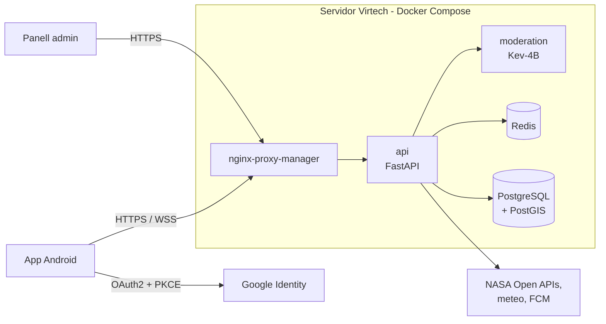

# Perseida

[English](README.md) | **Català** | [Español](README.es.md)

> 🚧 **En construcció.** El projecte és en fase d'incepció/primer sprint. L'estructura i el contingut següents descriuen l'estat **previst** segons la documentació del projecte i poden canviar.

**Perseida** és una aplicació mòbil multiplataforma de divulgació, exploració i seguiment de fenòmens astronòmics, desenvolupada com a projecte de PES (UPC-FIB). Aquest monorepo conté l'app mòbil i el panell d'administració, el backend, la infraestructura i la documentació del projecte.

## Què ofereix l'app

- **Mapa** interactiu i **llista** filtrable d'esdeveniments astronòmics actius i propers; subscripció, detalls i exportació al calendari (`.ics`).
- **APOD**: imatge astronòmica del dia de la NASA.
- **Gamificació**: ratxa diària, assoliments desbloquejables, quiz diari d'astrofísica.
- **Comunitat**: seguiment d'usuaris, sales de xat d'esdeveniment, xats 1-a-1, compartició i votació de fotografies, publicacions efímeres de 24 h.
- **Zones d'observació** recomanades a partir de meteorologia, contaminació lumínica i ubicació de l'esdeveniment.
- **Notificacions** (FCM), **mode offline**, **multillengua** (català, castellà, anglès) i **panell d'administració**.

Consulta el [README del frontend](frontend/README.ca.md) per a la llista completa.

## Estructura del repositori

| Directori | Contingut |
|---|---|
| [`backend/`](backend/README.ca.md) | Servei FastAPI: API REST, xat en temps real (WebSocket) i planificador dins del procés. Arquitectura hexagonal. |
| [`frontend/`](frontend/README.ca.md) | App mòbil React Native + Expo (de moment APK d'Android) i panell d'administració (React Native Web). |
| [`infra/`](infra/README.ca.md) | Configuració de Docker Compose i de desplegament, CI/CD (GitHub Actions). |
| [`obsidian_vault/`](obsidian_vault/README.ca.md) | Documentació del projecte com a vault d'Obsidian: context compartit per a l'equip i els assistents d'IA. |

## Visió general del sistema

Tot s'executa en **un únic servidor de Virtech** orquestrat amb **Docker Compose**.

Detalls: [infraestructura](infra/README.ca.md) · [arquitectura del backend](backend/README.ca.md#arquitectura-hexagonal) · [arquitectura del frontend](frontend/README.ca.md#arquitectura).

## Stack tecnològic

| Àrea | Tecnologia |
|---|---|
| Frontend | React Native + Expo, TypeScript, Tailwind, i18next, SQLite, `pnpm` |
| Backend | Python, FastAPI, SQLModel + Alembic, APScheduler, `uv` |
| Dades | PostgreSQL 18 + PostGIS, Redis 8 |
| Moderació | Kev-4B (model local) |
| Autenticació | Google OAuth2 + PKCE |
| Infraestructura | Docker Compose, nginx-proxy-manager, GitHub Actions, GHCR |
| Qualitat | `ruff`, `mypy`, ESLint, Prettier, `pytest`, Jest, SonarQube Cloud |

## Flux de treball i convencions

- GitFlow: `main` (producció, dispara el CD), `develop` (integració, CI), `feature/*`, `release/*`, `hotfix/*`. Sense push directe a `main`/`develop`.
- Tota PR cap a `develop` necessita CI en verd i l'aprovació d'algú que no sigui l'autor.
- El codi generat amb assistents d'IA passa per la mateixa revisió i els mateixos quality gates; l'autor de la PR n'és responsable.
- No facis mai commit de secrets ni de fitxers `.env`.

## Enllaços del projecte

- Repositori: [pes2627q1-21-gei-upc/perseida](https://github.com/pes2627q1-21-gei-upc/perseida)
- Backlog (Taiga): [alexga03-astronomia-pes](https://tree.taiga.io/project/alexga03-astronomia-pes)
- SonarQube Cloud: **encara no creat** (pendent).

## Llicència

Distribuït sota la [GNU Affero General Public License v3.0](LICENSE).

## Equip

Manel Alaminos · Simona Duelt · Alex Garcia · Oriol Orbea · Javier Pascual · Raquel Rubio
