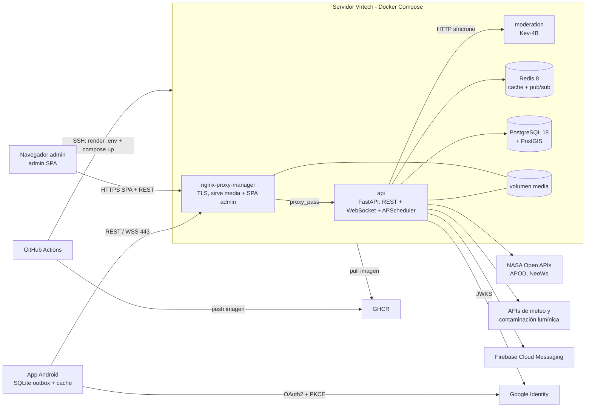

  

# Perseida

[English](README.md) | [Català](README.ca.md) | **Español**

> 🚧 **En construcción.** El proyecto está en fase de inception/primer sprint. La estructura y el contenido siguientes describen el estado **previsto** según la documentación del proyecto y pueden cambiar.

**Perseida** es una aplicación móvil multiplataforma de divulgación, exploración y seguimiento de fenómenos astronómicos, desarrollada como proyecto de PES (UPC-FIB). Este monorepo contiene la app móvil y el panel de administración, el backend, la infraestructura y la documentación del proyecto.

## Qué ofrece la app

- **Mapa** interactivo y **lista** filtrable de eventos astronómicos activos y próximos; eventos creados por los usuarios, suscripción, detalles y exportación al calendario (`.ics`).
- **APOD**: imagen astronómica del día de la NASA.
- **Gamificación**: racha diaria, logros desbloqueables, quiz diario de astrofísica, minijuego de astronomía para retar a amigos.
- **Comunidad**: seguimiento de usuarios, salas de chat de evento, chats 1-a-1, feed social y perfil de explorador (nivel, trofeos); *opcional:* votación de fotografías y publicaciones efímeras de 24 h.
- **Zonas de observación** recomendadas a partir de meteorología, contaminación lumínica y ubicación del evento.
- **Notificaciones** (FCM), **modo offline**, **multilingüe** (catalán, castellano, inglés) y **panel de administración**.

Consulta el [README del frontend](frontend/README.es.md) para la lista completa.

## Estructura del repositorio

| Directorio | Contenido |
|---|---|
| [`backend/`](backend/README.es.md) | Servicio FastAPI: API REST, chat en tiempo real (WebSocket) y planificador dentro del proceso. Arquitectura hexagonal. |
| [`frontend/`](frontend/README.es.md) | App móvil React Native + Expo (por ahora APK de Android) y panel de administración (React Native Web). |
| [`infra/`](infra/README.es.md) | Configuración de Docker Compose y de despliegue, CI/CD (GitHub Actions). |
| [`obsidian_vault/`](obsidian_vault/README.es.md) | Documentación del proyecto como vault de Obsidian: contexto compartido para el equipo y los asistentes de IA. |

## Visión general del sistema

Todo se ejecuta en **un único servidor de Virtech** orquestado con **Docker Compose**.

Limitaciones conocidas (asumidas en un proyecto académico): un único servidor es un punto único de fallo, sin escalado horizontal ni copias de seguridad automáticas. iOS es compatible (React Native) pero no se despliega, ya que requeriría un Mac, una cuenta de Apple Developer y una clave APNs.

Detalles: [infraestructura](infra/README.es.md) · [arquitectura del backend](backend/README.es.md#arquitectura-hexagonal) · [arquitectura del frontend](frontend/README.es.md#arquitectura).

## Stack tecnológico

| Área | Tecnología |
|---|---|
| Frontend | React Native + Expo, TypeScript, Tailwind, i18next, SQLite, `pnpm` |
| Backend | Python, FastAPI, SQLModel + Alembic, APScheduler, `uv` |
| Datos | PostgreSQL 18 + PostGIS, Redis 8 |
| Moderación | Kev-4B (modelo local) |
| Autenticación | Google OAuth2 + PKCE |
| Infraestructura | Docker Compose, nginx-proxy-manager, GitHub Actions, GHCR |
| Calidad | `ruff`, `mypy`, ESLint, Prettier, `pytest`, Jest, SonarQube Cloud |

## Flujo de trabajo y convenciones

- Scrum: 3 sprints de unas 3 semanas, un Scrum Master que rota cada sprint y el profesorado de la asignatura como Product Owner (el cliente). El backlog está en Taiga.
- Releases: una por sprint, SemVer a partir de `0.1.0`. El Scrum Master del sprint crea `release/*` antes de la sprint review; al fusionar en `main` se despliega el backend y se publica el APK en una release de GitHub.
- GitFlow: `main` (producción, dispara el CD), `develop` (integración, CI), `feature/*`, `release/*`, `hotfix/*`. Sin push directo a `main`/`develop`.
- Toda PR hacia `develop` necesita CI en verde y la aprobación de alguien que no sea el autor.
- El código generado con asistentes de IA pasa por la misma revisión y los mismos quality gates; el autor de la PR es responsable de él.
- No hagas nunca commit de secretos ni de ficheros `.env`.

## Contrato de servicio con Spotwise (grupo 21B)

- **Proporcionado:** `GET /api/events/active` y `GET /api/events/upcoming` devuelven eventos astronómicos relevantes (título, descripción corta, categoría como `lunar`, `solar`, `meteor_shower`).
- **Consumido:** la búsqueda de espacios de Spotwise (bibliotecas y cafeterías de Barcelona) para sugerir puntos de encuentro en los eventos.
- El contrato se acordó en el Sprint 1; los cambios en los Sprints 2-3 deben notificarse y justificarse, ya que afectan a ambos equipos.

## Enlaces del proyecto

- Repositorio: [pes2627q1-21-gei-upc/perseida](https://github.com/pes2627q1-21-gei-upc/perseida)
- Backlog (Taiga): [alexga03-astronomia-pes](https://tree.taiga.io/project/alexga03-astronomia-pes)
- SonarQube Cloud: **aún no creado** (pendiente).

## Licencia

Distribuido bajo la [GNU Affero General Public License v3.0](LICENSE).

## Equipo

Manel Alaminos · Simona Duelt · Alex Garcia · Oriol Orbea · Javier Pascual · Raquel Rubio
