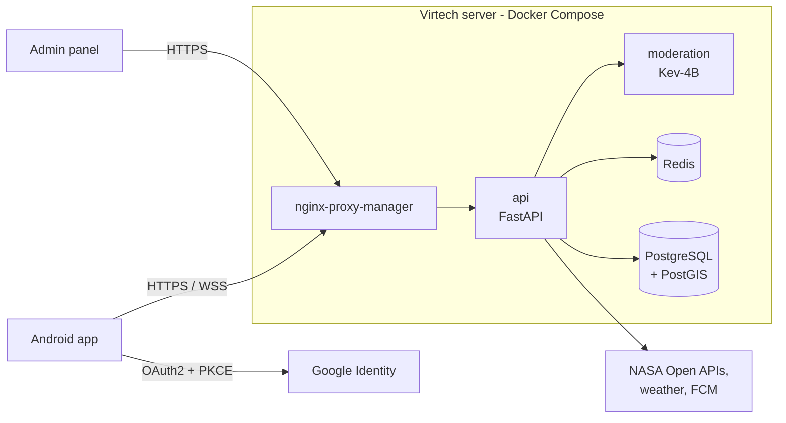

# Perseida

**English** | [Català](README.ca.md) | [Español](README.es.md)

> 🚧 **Under construction.** The project is in its inception/first-sprint phase. Structure and contents below describe the **planned** state defined in the project documentation and may change.

**Perseida** is a multiplatform mobile app for astronomy outreach, exploration and tracking of astronomical events, built as a PES project (UPC-FIB). This monorepo contains the mobile app and admin panel, the backend, the infrastructure and the project documentation.

## What the app offers

- Interactive **map** and filterable **list** of active and upcoming astronomical events; subscription, details and calendar export (`.ics`).
- **APOD**: NASA Astronomy Picture of the Day.
- **Gamification**: daily streak, unlockable achievements, daily astrophysics quiz.
- **Community**: follow users, event chat rooms, 1-to-1 chats, photo sharing and voting, 24 h ephemeral posts.
- **Observation zones** recommended from weather, light pollution and event location.
- **Notifications** (FCM), **offline mode**, **multi-language** (Catalan, Spanish, English) and an **admin panel**.

See the [frontend README](frontend/README.md) for the full list.

## Repository structure

| Directory | Content |
|---|---|
| [`backend/`](backend/README.md) | FastAPI service: REST API, real-time chat (WebSocket) and in-process scheduler. Hexagonal architecture. |
| [`frontend/`](frontend/README.md) | React Native + Expo mobile app (Android APK for now) and admin panel (React Native Web). |
| [`infra/`](infra/README.md) | Docker Compose and deployment configuration, CI/CD (GitHub Actions). |
| [`obsidian_vault/`](obsidian_vault/README.md) | Project documentation as an Obsidian vault: shared context for the team and AI assistants. |

## System overview

Everything runs on **a single Virtech server** orchestrated with **Docker Compose**.

Details: [infrastructure](infra/README.md) · [backend architecture](backend/README.md#architecture-hexagonal) · [frontend architecture](frontend/README.md#architecture).

## Tech stack

| Area | Technology |
|---|---|
| Frontend | React Native + Expo, TypeScript, Tailwind, i18next, SQLite, `pnpm` |
| Backend | Python, FastAPI, SQLModel + Alembic, APScheduler, `uv` |
| Data | PostgreSQL 18 + PostGIS, Redis 8 |
| Moderation | Kev-4B (local model) |
| Auth | Google OAuth2 + PKCE |
| Infrastructure | Docker Compose, nginx-proxy-manager, GitHub Actions, GHCR |
| Quality | `ruff`, `mypy`, ESLint, Prettier, `pytest`, Jest, SonarQube Cloud |

## Workflow and conventions

- GitFlow: `main` (production, triggers CD), `develop` (integration, CI), `feature/*`, `release/*`, `hotfix/*`. No direct push to `main`/`develop`.
- Every PR to `develop` needs green CI and approval from someone other than the author.
- Code generated with AI assistants goes through the same review and quality gates; the PR author is responsible for it.
- Never commit secrets or `.env` files.

## Project links

- Repository: [pes2627q1-21-gei-upc/perseida](https://github.com/pes2627q1-21-gei-upc/perseida)
- Backlog (Taiga): [alexga03-astronomia-pes](https://tree.taiga.io/project/alexga03-astronomia-pes)
- SonarQube Cloud: **not created yet** (pending).

## License

Distributed under the [GNU Affero General Public License v3.0](LICENSE).

## Team

Manel Alaminos · Simona Duelt · Alex Garcia · Oriol Orbea · Javier Pascual · Raquel Rubio
