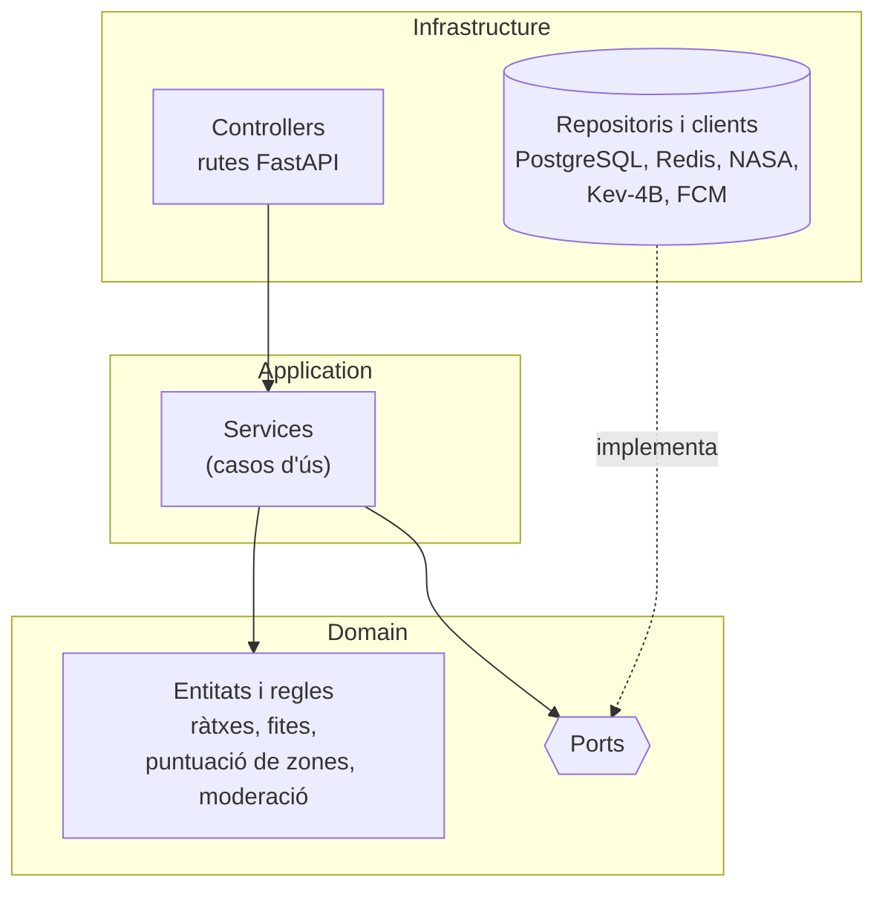

# Perseida · Backend

[English](README.md) | **Català** | [Español](README.es.md)

> 🚧 **En construcció.** El projecte és al primer sprint. `app/` i `tests/` ja són reals (el mòdul `health` és l'exemple de referència), però la majoria de mòduls (persistència, autenticació, xat, planificador) encara no estan implementats.

Backend de **Perseida**, una aplicació mòbil multiplataforma de divulgació, exploració i seguiment de fenòmens astronòmics, desenvolupada com a projecte de PES (UPC-FIB). Exposa l'API REST i el xat en temps real que fan servir l'app mòbil i el panell d'administració, i integra les NASA Open APIs i altres proveïdors externs.

## Responsabilitats

Un únic procés FastAPI integra tres responsabilitats:

- **API REST** per a l'app mòbil i el panell d'administració (Swagger/OpenAPI sempre sincronitzat amb el codi).
- **WebSocket** per al xat en temps real (sales d'esdeveniment i 1-a-1), amb Redis pub/sub.
- **Planificador (APScheduler, dins del procés)** per a tasques periòdiques: notificacions programades, reinici de ràtxes diàries i purga de contingut caducat (publicacions multimèdia de 24 h).

Àrees funcionals principals: esdeveniments astronòmics (catàleg, filtres, mapa, subscripcions, exportació `.ics`), contingut diari de la NASA (APOD), gamificació (ràtxes, fites, quiz diari), comunitat (seguiment, xats d'esdeveniment, xats directes, votació de fotografies), recomanació de zones d'observació (meteorologia + contaminació lumínica + PostGIS), notificacions (FCM), moderació i administració.

## Stack tecnològic

| Àmbit | Tecnologia |
|---|---|
| Llenguatge | Python 3.14 |
| Framework | FastAPI (async) |
| ORM / migracions | SQLModel (SQLAlchemy) · Alembic (s'executa automàticament a l'entrypoint del contenidor) |
| Base de dades | PostgreSQL 18 + PostGIS (font de veritat) |
| Cache / pub-sub | Redis 8 (cache lazy amb TTL; res es persisteix només aquí) |
| Planificador | APScheduler |
| Autenticació | Google OAuth2 + PKCE · validació de tokens de Google via JWKS · sessió pròpia del backend (JWT) |
| Moderació | Microservei Kev-4B (model local, crida síncrona) |
| Dependències | `uv` (versions exactes, `uv.lock` versionat) |
| Qualitat | `ruff` (lint + format, complexitat màx. 10), `mypy` estricte, SonarQube Cloud |
| Tests | `pytest`, `pytest-asyncio`, `pytest-cov`, `httpx`, `respx` |

## Arquitectura: hexagonal



- `domain`: lògica de negoci sense dependència de frameworks, BD ni serveis externs (l'única llibreria externa permesa és Pydantic). Conté les entitats, els value objects, els errors de domini i els **ports** (`Protocol`) que descriuen què necessita el negoci de l'exterior ([ADR-0016](../obsidian_vault/decisions/0016-ports-i-entitats-riques-al-domini.md)).
- `application`: **services** (casos d'ús) que orquestren les entitats a través dels ports. Sense regles de negoci pròpies ni FastAPI, SQLModel, Redis o httpx.
- `infrastructure`: tot el que toca l'exterior: **controllers** (rutes FastAPI), **repositoris** i clients externs que implementen els ports, i el *composition root* (`dependencies.py`, `@lru_cache` + `Depends`, [ADR-0017](../obsidian_vault/decisions/0017-injeccio-de-dependencies-i-services-singleton.md)).

**Regla de dependències:** `domain` només importa la biblioteca estàndard, Pydantic i `app.domain`; `application` només això i `app.application`; `infrastructure` pot importar qualsevol capa. Ho verifica `tests/architecture/test_layer_dependencies.py`.

Patró per a dades externes (p. ex. APOD): la primera petició crida l'API externa i en desa el resultat a Redis (i a PostgreSQL quan cal); les següents se serveixen des de la cache. Si l'API externa cau, es retornen les dades de la cache en lloc d'un 500.

## Estructura

```
backend/
├── app/
│   ├── main.py            # app factory de FastAPI i lifespan
│   ├── domain/            # entities, value objects, ports
│   │   └── health/        # models i ports
│   ├── application/       # services
│   │   └── health/        # cas d'ús
│   └── infrastructure/    # routers, persistence, redis, clients
│       └── health/        # adaptadors, router i cablejat
├── tests/
│   ├── unit/              # domini i application, amb fakes
│   ├── integration/       # API amb httpx + ASGITransport
│   ├── architecture/      # regles de dependències entre capes
│   ├── fakes/             # ports en memòria per als tests
│   ├── fixtures/          # respostes enregistrades de NASA/meteo, dades geo
│   ├── factories/         # usuaris, esdeveniments, missatges, fites
│   └── moderation_dataset/# joc etiquetat d'avaluació de Kev-4B (ca/es/en)
├── pyproject.toml
└── uv.lock
```

`alembic/` (migracions) i `.env.example` arribaran amb la persistència.

### Afegir una funcionalitat

El mòdul `health` és l'exemple de referència. Per a un mòdul nou `<nom>`:

1. **Domini** (`app/domain/<nom>/`): entitats/value objects a `models.py` i els ports a `ports.py` (p. ex. `HealthReport` i el protocol `HealthCheck`).
2. **Application** (`app/application/<nom>/`): el service que usa els ports (`HealthService`), sense FastAPI.
3. **Infrastructure** (`app/infrastructure/<nom>/`): els adaptadors que implementen els ports (`checks.py`), el provider `get_<nom>_service` amb `@lru_cache` i `<Nom>ServiceDep` (`dependencies.py`), i el router amb el seu model de resposta (`router.py`).
4. Registra el router a `create_app()` (`app/main.py`).
5. **Tests**, després del codi: unitaris amb fakes (`tests/fakes/`), integració de l'API amb `dependency_overrides`; el test d'arquitectura continua verificant les capes.

## Contractes de servei (Spotwise, grup 21B)

- **Proveïm:** `GET /api/events/active` i `GET /api/events/upcoming` retornen els esdeveniments astronòmics rellevants (títol, descripció breu, categoria com `lunar`, `solar`, `meteor_shower`).
- **Consumim:** la cerca d'espais de Spotwise (biblioteques i cafeteries de Barcelona) per suggerir punts de trobada als esdeveniments.

## Executar i testejar

Prerequisit: [`uv`](https://docs.astral.sh/uv/). La versió de Python (3.14) la fixa `.python-version` i `uv` la instal·la si cal.

```bash
cd backend                    # des de l'arrel del repositori
uv sync                       # instal·la les dependències (entorn virtual a .venv)
uv lock --check               # verifica que uv.lock està al dia amb pyproject.toml
uv run ruff check .           # lint
uv run ruff format --check .  # comprova el format sense modificar fitxers
uv run mypy .                 # tipatge estricte
uv run pytest                 # tests (amb cobertura)
uv run uvicorn app.main:app --reload  # arrenca l'API (http://127.0.0.1:8000/docs)
```

- Les dependències s'afegeixen amb `uv add` / `uv add --dev` i versió exacta (`==`); no s'usa `pip`.
- Tota la configuració (ruff, mypy, pytest, cobertura) és a `pyproject.toml`.

L'stack complet (API, PostgreSQL/PostGIS, Redis, moderació) s'arrenca amb Docker Compose des de [`../infra`](../infra/README.ca.md). Copia `.env.example` a `.env`; els secrets reals mai es versionen.

## Testing i qualitat

- Piràmide de proves: ~70 % unitàries, ~30 % d'integració (PostgreSQL/PostGIS i Redis efímers, API amb `httpx.AsyncClient`, APIs externes simulades amb `respx`). No hi ha proves end-to-end a l'app mòbil.
- Objectius de cobertura: domini ≥ 80 %, aplicació ≥ 70 %, codi nou de cada PR ≥ 70 % (imposat pel Quality Gate de SonarQube Cloud).
- Llindars de requisits no funcionals verificats amb tests: recursos en cache ≤ 200 ms, consultes de proximitat ≤ 150 ms, endpoints privats rebutgen peticions sense sessió vàlida (401/403).

## Convencions

- GitFlow: `main` (producció, dispara CD), `develop` (integració, CI), `feature/*`, `release/*`, `hotfix/*`. Cap push directe a `main`/`develop`.
- Tota PR cap a `develop` necessita CI en verd i l'aprovació d'una persona diferent de l'autora.
- Definition of Done: criteris d'acceptació complerts, subtasques tancades, integrada a `develop` amb una PR revisada i amb les comprovacions superades.

## Relacionat

[Frontend](../frontend/README.ca.md) · [Infraestructura](../infra/README.ca.md) · [Obsidian vault](../obsidian_vault/README.ca.md)

## Equip

Manel Alaminos · Simona Duelt · Alex Garcia · Oriol Orbea · Javier Pascual · Raquel Rubio
