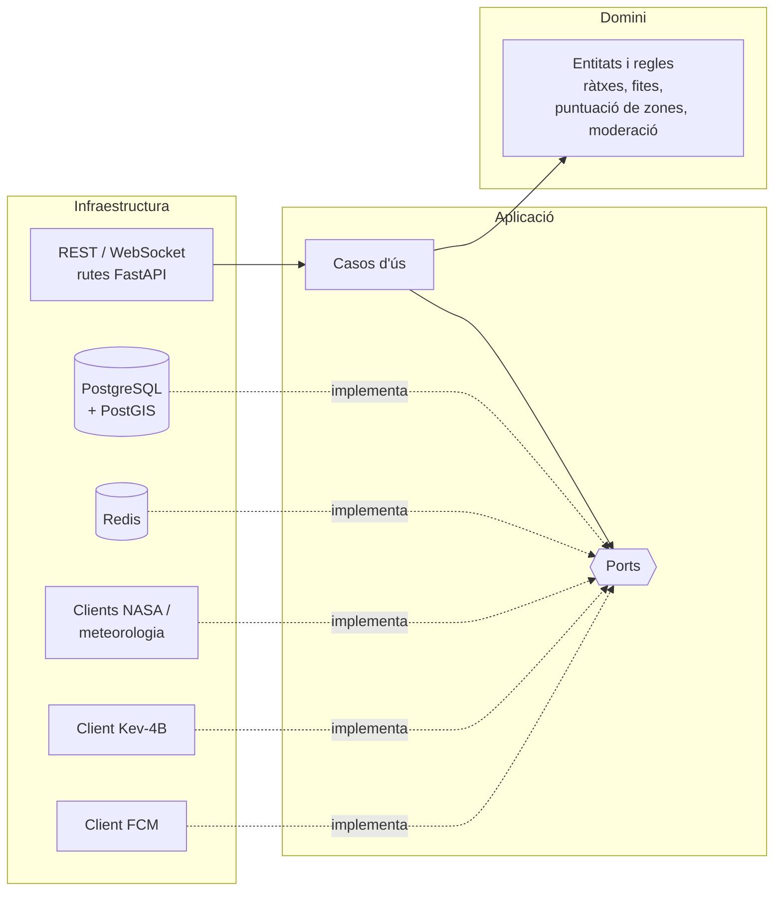

# Perseida · Backend

[English](README.md) | **Català** | [Español](README.es.md)

> 🚧 **En construcció.** El projecte és en fase d'incepció/primer sprint. L'estructura i les ordres següents descriuen l'estat **previst** segons la documentació del projecte (incepció 1 i 2 i memòria) i poden canviar.

Backend de **Perseida**, una aplicació mòbil multiplataforma de divulgació, exploració i seguiment de fenòmens astronòmics, desenvolupada com a projecte de PES (UPC-FIB). Exposa l'API REST i el xat en temps real que fan servir l'app mòbil i el panell d'administració, i integra les NASA Open APIs i altres proveïdors externs.

## Responsabilitats

Un únic procés FastAPI integra tres responsabilitats:

- **API REST** per a l'app mòbil i el panell d'administració (Swagger/OpenAPI sempre sincronitzat amb el codi).
- **WebSocket** per al xat en temps real (sales d'esdeveniment i 1-a-1), amb Redis pub/sub.
- **Planificador (APScheduler, dins del procés)** per a tasques periòdiques: notificacions programades, reinici de ràtxes diàries i purga de contingut caducat (publicacions multimèdia de 24 h).

Àrees funcionals principals: esdeveniments astronòmics (catàleg, filtres, mapa, subscripcions, exportació `.ics`), contingut diari de la NASA (APOD), gamificació (ràtxes, fites, quiz diari), comunitat (seguiment, xats d'esdeveniment, xats directes, votació de fotografies), recomanació de zones d'observació (meteorologia + contaminació lumínica + PostGIS), notificacions (FCM), moderació i administració.

## Stack tecnològic

| Àmbit | Tecnologia |
|---|---|
| Llenguatge | Python |
| Framework | FastAPI (async) |
| ORM / migracions | SQLModel (SQLAlchemy) · Alembic (s'executa automàticament a l'entrypoint del contenidor) |
| Base de dades | PostgreSQL 18 + PostGIS (font de veritat) |
| Cache / pub-sub | Redis 8 (cache lazy amb TTL; res es persisteix només aquí) |
| Planificador | APScheduler |
| Autenticació | Google OAuth2 + PKCE · validació de tokens de Google via JWKS · sessió pròpia del backend (JWT) |
| Moderació | Microservei Kev-4B (model local, crida síncrona) |
| Dependències | `uv` |
| Qualitat | `ruff` (lint + format, complexitat màx. 10), `mypy` estricte, SonarQube Cloud |
| Tests | `pytest`, `pytest-asyncio`, `pytest-xdist`, `pytest-cov`, `httpx`, `respx` |

## Arquitectura: hexagonal



- `domain`: lògica de negoci sense dependència de frameworks, BD ni serveis externs. Desenvolupada amb **TDD**.
- `application`: casos d'ús que orquestren el domini a través de ports.
- `infrastructure`: adaptadors (API, persistència, Redis, clients externs).

Patró per a dades externes (p. ex. APOD): la primera petició crida l'API externa i en desa el resultat a Redis (i a PostgreSQL quan cal); les següents se serveixen des de la cache. Si l'API externa cau, es retornen les dades de la cache en lloc d'un 500.

## Estructura prevista

```
backend/
├── app/
│   ├── domain/            # entitats, value objects, serveis de domini
│   ├── application/       # casos d'ús i ports
│   └── infrastructure/    # rutes API, persistència, redis, clients externs
├── alembic/               # migracions
├── tests/
│   ├── fixtures/          # respostes enregistrades de NASA/meteo, dades geo
│   ├── factories/         # usuaris, esdeveniments, missatges, fites
│   └── moderation_dataset/# joc etiquetat d'avaluació de Kev-4B (ca/es/en)
├── pyproject.toml
└── .env.example
```

## Contractes de servei (Spotwise, grup 21B)

- **Proveïm:** `GET /api/events/active` i `GET /api/events/upcoming` retornen els esdeveniments astronòmics rellevants (títol, descripció breu, categoria com `lunar`, `solar`, `meteor_shower`).
- **Consumim:** la cerca d'espais de Spotwise (biblioteques i cafeteries de Barcelona) per suggerir punts de trobada als esdeveniments.

## Executar i testejar (previst)

```bash
uv sync                     # instal·la dependències
uv run ruff check . && uv run ruff format --check .
uv run mypy .
uv run pytest               # tests unitaris + integració
```

L'stack complet (API, PostgreSQL/PostGIS, Redis, moderació) s'arrenca amb Docker Compose des de [`../infra`](../infra/README.ca.md). Copia `.env.example` a `.env`; els secrets reals mai es versionen.

## Testing i qualitat

- Piràmide de proves: ~70 % unitàries, ~30 % d'integració (PostgreSQL/PostGIS i Redis efímers, API amb `httpx.AsyncClient`, APIs externes simulades amb `respx`). No hi ha proves end-to-end a l'app mòbil.
- Objectius de cobertura: domini ≥ 80 %, aplicació ≥ 70 %, codi nou de cada PR ≥ 70 % (imposat pel Quality Gate de SonarQube Cloud).
- Llindars de requisits no funcionals verificats amb tests: recursos en cache ≤ 200 ms, consultes de proximitat ≤ 150 ms, endpoints privats rebutgen peticions sense sessió vàlida (401/403).

## Convencions

- GitFlow: `main` (producció, dispara CD), `develop` (integració, CI), `feature/*`, `release/*`, `hotfix/*`. Cap push directe a `main`/`develop`.
- Tota PR cap a `develop` necessita CI en verd i l'aprovació d'una persona diferent de l'autora.
- Definition of Done: criteris d'acceptació complerts, subtasques tancades, integrada a `develop` amb una PR revisada i amb les comprovacions superades.

## Relacionat

[Frontend](../frontend/README.ca.md) · [Infraestructura](../infra/README.ca.md) · [Obsidian vault](../obsidian_vault/README.ca.md)

## Equip

Manel Alaminos · Simona Duelt · Alex Garcia · Oriol Orbea · Javier Pascual · Raquel Rubio
