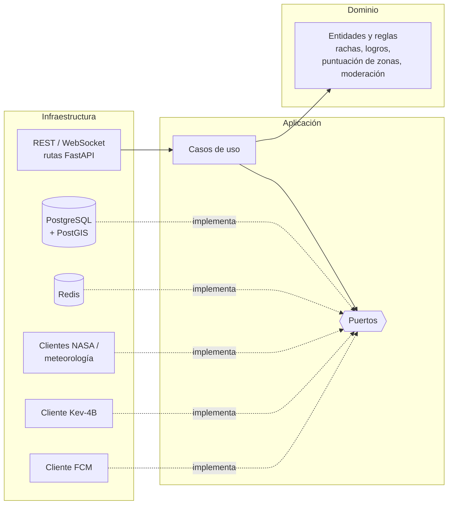

# Perseida · Backend

[English](README.md) | [Català](README.ca.md) | **Español**

> 🚧 **En construcción.** El proyecto está en fase de inception/primer sprint. La estructura sigue siendo la **prevista** según la documentación del proyecto (inception 1 y 2 y memoria) y puede cambiar, pero los comandos de la sección de ejecutar y testear ya están verificados.

Backend de **Perseida**, una aplicación móvil multiplataforma de divulgación, exploración y seguimiento de fenómenos astronómicos, desarrollada como proyecto de PES (UPC-FIB). Expone la API REST y el chat en tiempo real que usan la app móvil y el panel de administración, e integra las NASA Open APIs y otros proveedores externos.

## Responsabilidades

Un único proceso FastAPI integra tres responsabilidades:

- **API REST** para la app móvil y el panel de administración (Swagger/OpenAPI siempre sincronizado con el código).
- **WebSocket** para el chat en tiempo real (salas de evento y 1-a-1), con Redis pub/sub.
- **Planificador (APScheduler, dentro del proceso)** para tareas periódicas: notificaciones programadas, reinicio de rachas diarias y purga de contenido caducado (publicaciones multimedia de 24 h).

Áreas funcionales principales: eventos astronómicos (catálogo, filtros, mapa, suscripciones, exportación `.ics`), contenido diario de la NASA (APOD), gamificación (rachas, logros, quiz diario), comunidad (seguimiento, chats de evento, chats directos, votación de fotografías), recomendación de zonas de observación (meteorología + contaminación lumínica + PostGIS), notificaciones (FCM), moderación y administración.

## Stack tecnológico

| Ámbito | Tecnología |
|---|---|
| Lenguaje | Python 3.14 |
| Framework | FastAPI (async) |
| ORM / migraciones | SQLModel (SQLAlchemy) · Alembic (se ejecuta automáticamente en el entrypoint del contenedor) |
| Base de datos | PostgreSQL 18 + PostGIS (fuente de verdad) |
| Caché / pub-sub | Redis 8 (caché lazy con TTL; nada se persiste solo aquí) |
| Planificador | APScheduler |
| Autenticación | Google OAuth2 + PKCE · validación de tokens de Google vía JWKS · sesión propia del backend (JWT) |
| Moderación | Microservicio Kev-4B (modelo local, llamada síncrona) |
| Dependencias | `uv` (versiones exactas, `uv.lock` versionado) |
| Calidad | `ruff` (lint + formato, complejidad máx. 10), `mypy` estricto, SonarQube Cloud |
| Tests | `pytest`, `pytest-asyncio`, `pytest-cov`, `httpx`, `respx` |

## Arquitectura: hexagonal



- `domain`: lógica de negocio sin dependencia de frameworks, BD ni servicios externos. Desarrollada con **TDD**.
- `application`: casos de uso que orquestan el dominio a través de puertos.
- `infrastructure`: adaptadores (API, persistencia, Redis, clientes externos).

Patrón para datos externos (p. ej. APOD): la primera petición llama a la API externa y guarda el resultado en Redis (y en PostgreSQL cuando hace falta); las siguientes se sirven desde la caché. Si la API externa cae, se devuelven los datos de la caché en lugar de un 500.

## Estructura prevista

```
backend/
├── app/
│   ├── domain/            # entidades, value objects, servicios de dominio
│   ├── application/       # casos de uso y puertos
│   └── infrastructure/    # rutas API, persistencia, redis, clientes externos
├── alembic/               # migraciones
├── tests/
│   ├── fixtures/          # respuestas grabadas de NASA/meteo, datos geo
│   ├── factories/         # usuarios, eventos, mensajes, logros
│   └── moderation_dataset/# conjunto etiquetado de evaluación de Kev-4B (ca/es/en)
├── pyproject.toml
└── .env.example
```

## Contratos de servicio (Spotwise, grupo 21B)

- **Proveemos:** `GET /api/events/active` y `GET /api/events/upcoming` devuelven los eventos astronómicos relevantes (título, descripción breve, categoría como `lunar`, `solar`, `meteor_shower`).
- **Consumimos:** la búsqueda de espacios de Spotwise (bibliotecas y cafeterías de Barcelona) para sugerir puntos de encuentro en los eventos.

## Ejecutar y testear

Prerrequisito: [`uv`](https://docs.astral.sh/uv/). La versión de Python (3.14) la fija `.python-version` y `uv` la instala si hace falta.

```bash
cd backend                    # desde la raíz del repositorio
uv sync                       # instala las dependencias (entorno virtual en .venv)
uv lock --check               # verifica que uv.lock está al día con pyproject.toml
uv run ruff check .           # lint
uv run ruff format --check .  # comprueba el formato sin modificar archivos
uv run mypy .                 # tipado estricto
uv run pytest                 # tests (con cobertura)
```

- Las dependencias se añaden con `uv add` / `uv add --dev` y versión exacta (`==`); no se usa `pip`.
- Toda la configuración (ruff, mypy, pytest, cobertura) está en `pyproject.toml`.
- Sin tests, `pytest` termina con «no tests ran» (código 5); no es un error.

El stack completo (API, PostgreSQL/PostGIS, Redis, moderación) se levanta con Docker Compose desde [`../infra`](../infra/README.es.md). Copia `.env.example` a `.env`; los secretos reales nunca se versionan.

## Testing y calidad

- Pirámide de pruebas: ~70 % unitarias, ~30 % de integración (PostgreSQL/PostGIS y Redis efímeros, API con `httpx.AsyncClient`, APIs externas simuladas con `respx`). No hay pruebas end-to-end en la app móvil.
- Objetivos de cobertura: dominio ≥ 80 %, aplicación ≥ 70 %, código nuevo de cada PR ≥ 70 % (exigido por el Quality Gate de SonarQube Cloud).
- Umbrales de requisitos no funcionales verificados con tests: recursos en caché ≤ 200 ms, consultas de proximidad ≤ 150 ms, endpoints privados rechazan peticiones sin sesión válida (401/403).

## Convenciones

- GitFlow: `main` (producción, dispara CD), `develop` (integración, CI), `feature/*`, `release/*`, `hotfix/*`. Ningún push directo a `main`/`develop`.
- Toda PR hacia `develop` necesita CI en verde y la aprobación de una persona distinta de la autora.
- Definition of Done: criterios de aceptación cumplidos, subtareas cerradas, integrada en `develop` con una PR revisada y con las comprobaciones superadas.

## Relacionado

[Frontend](../frontend/README.es.md) · [Infraestructura](../infra/README.es.md) · [Obsidian vault](../obsidian_vault/README.es.md)

## Equipo

Manel Alaminos · Simona Duelt · Alex Garcia · Oriol Orbea · Javier Pascual · Raquel Rubio
