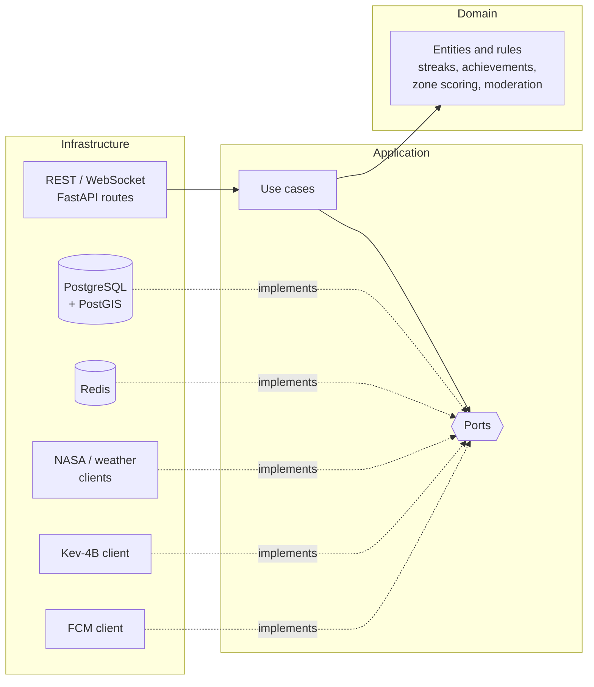

# Perseida · Backend

**English** | [Català](README.ca.md) | [Español](README.es.md)

> 🚧 **Under construction.** The project is in its inception/first-sprint phase. Structure and commands below describe the **planned** state defined in the project documentation (inception 1 and 2, and the project report) and may change.

Backend of **Perseida**, a multiplatform mobile app for astronomy outreach, exploration and tracking of astronomical events, built as a PES project (UPC-FIB). It exposes the REST API and real-time chat used by the mobile app and the admin panel, and integrates NASA Open APIs and other external providers.

## Responsibilities

A single FastAPI process integrates three responsibilities:

- **REST API** for the mobile app and the admin panel (Swagger/OpenAPI always in sync with the code).
- **WebSocket** for real-time chat (event rooms and 1-to-1), with Redis pub/sub.
- **Scheduler (APScheduler, in-process)** for periodic jobs: scheduled notifications, daily streak resets, and purge of expired content (24 h media posts).

Main functional areas: astronomical events (catalog, filters, map, subscriptions, `.ics` export), daily NASA content (APOD), gamification (streaks, achievements, daily quiz), community (follow, event chats, direct chats, photo voting), observation-zone recommendation (weather + light pollution + PostGIS), notifications (FCM), moderation and administration.

## Tech stack

| Area | Technology |
|---|---|
| Language | Python |
| Framework | FastAPI (async) |
| ORM / migrations | SQLModel (SQLAlchemy) · Alembic (run automatically at container entrypoint) |
| Database | PostgreSQL 18 + PostGIS (source of truth) |
| Cache / pub-sub | Redis 8 (lazy cache with TTL; nothing persisted only here) |
| Scheduler | APScheduler |
| Auth | Google OAuth2 + PKCE · Google token validation via JWKS · own backend session (JWT) |
| Moderation | Kev-4B microservice (local model, synchronous call) |
| Dependencies | `uv` |
| Quality | `ruff` (lint + format, max complexity 10), `mypy` strict, SonarQube Cloud |
| Tests | `pytest`, `pytest-asyncio`, `pytest-xdist`, `pytest-cov`, `httpx`, `respx` |

## Architecture: hexagonal



- `domain`: business logic with no dependency on frameworks, DB or external services. Developed with **TDD**.
- `application`: use cases that orchestrate the domain through ports.
- `infrastructure`: adapters (API, persistence, Redis, external clients).

Pattern for external data (e.g. APOD): the first request calls the external API and stores the result in Redis (and PostgreSQL where needed); later requests are served from cache. If the external API is down, cached data is returned instead of a 500.

## Planned structure

```
backend/
├── app/
│   ├── domain/            # entities, value objects, domain services
│   ├── application/       # use cases and ports
│   └── infrastructure/    # API routes, persistence, redis, external clients
├── alembic/               # migrations
├── tests/
│   ├── fixtures/          # recorded NASA/weather responses, geo data
│   ├── factories/         # users, events, messages, achievements
│   └── moderation_dataset/# labeled Kev-4B evaluation set (ca/es/en)
├── pyproject.toml
└── .env.example
```

## Service contracts (Spotwise, group 21B)

- **Provided:** `GET /api/events/active` and `GET /api/events/upcoming` return relevant astronomical events (title, short description, category such as `lunar`, `solar`, `meteor_shower`).
- **Consumed:** Spotwise's space search (libraries and cafés in Barcelona) to suggest meeting points for events.

## Run and test (planned)

```bash
uv sync                     # install dependencies
uv run ruff check . && uv run ruff format --check .
uv run mypy .
uv run pytest               # unit + integration tests
```

The full stack (API, PostgreSQL/PostGIS, Redis, moderation) is started with Docker Compose from [`../infra`](../infra/README.md). Copy `.env.example` to `.env`; real secrets are never committed.

## Testing and quality

- Test pyramid: ~70 % unit, ~30 % integration (ephemeral PostgreSQL/PostGIS and Redis, API with `httpx.AsyncClient`, external APIs mocked with `respx`). No end-to-end tests on the mobile app.
- Coverage targets: domain ≥ 80 %, application ≥ 70 %, new code in each PR ≥ 70 % (enforced by the SonarQube Cloud Quality Gate).
- NFR thresholds verified by tests: cached resources ≤ 200 ms, proximity queries ≤ 150 ms, private endpoints reject requests without a valid session (401/403).

## Conventions

- GitFlow: `main` (production, triggers CD), `develop` (integration, CI), `feature/*`, `release/*`, `hotfix/*`. No direct push to `main`/`develop`.
- Every PR to `develop` needs green CI and approval from someone other than the author.
- Definition of Done: acceptance criteria met, subtasks closed, merged to `develop` via a reviewed PR with passing checks.

## Related

[Frontend](../frontend/README.md) · [Infrastructure](../infra/README.md) · [Obsidian vault](../obsidian_vault/README.md)

## Team

Manel Alaminos · Simona Duelt · Alex Garcia · Oriol Orbea · Javier Pascual · Raquel Rubio
