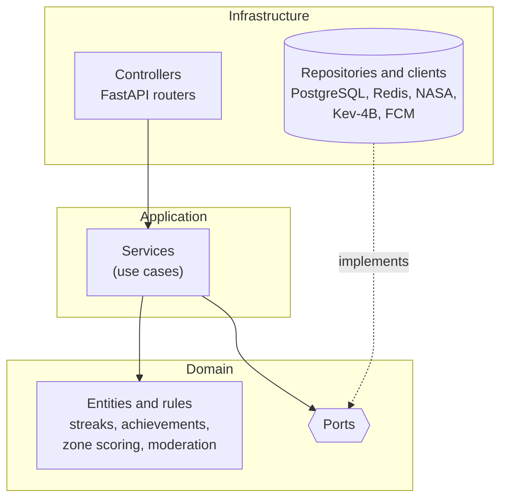

# Perseida · Backend

**English** | [Català](README.ca.md) | [Español](README.es.md)

> 🚧 **Under construction.** The project is in its first sprint. `app/` and `tests/` are real (the `health` module is the reference example), but most modules (persistence, auth, chat, scheduler) are not implemented yet.

Backend of **Perseida**, a multiplatform mobile app for astronomy outreach, exploration and tracking of astronomical events, built as a PES project (UPC-FIB). It exposes the REST API and real-time chat used by the mobile app and the admin panel, and integrates NASA Open APIs and other external providers.

## Responsibilities

A single FastAPI process integrates three responsibilities:

- **REST API** for the mobile app and the admin panel (Swagger/OpenAPI always in sync with the code).
- **WebSocket** for real-time chat (event rooms and 1-to-1), with Redis pub/sub.
- **Scheduler (APScheduler, in-process)** for periodic jobs: scheduled notifications, daily streak resets, and purge of expired content (24 h media posts).

Main functional areas: astronomical events (catalog, filters, map, subscriptions, `.ics` export), daily NASA content (APOD), gamification (streaks, achievements, daily quiz), community (follow, event chats, direct chats, photo voting), observation-zone recommendation (weather + light pollution + PostGIS), notifications (FCM), moderation and administration.

## Tech stack

| Area | Technology |
|---|---|
| Language | Python 3.14 |
| Framework | FastAPI (async) |
| ORM / migrations | SQLModel (SQLAlchemy) · Alembic (run automatically at container entrypoint) |
| Database | PostgreSQL 18 + PostGIS (source of truth) |
| Cache / pub-sub | Redis 8 (lazy cache with TTL; nothing persisted only here) |
| Scheduler | APScheduler |
| Auth | Google OAuth2 + PKCE · Google token validation via JWKS · own backend session (JWT) |
| Moderation | Kev-4B microservice (local model, synchronous call) |
| Dependencies | `uv` (exact versions, `uv.lock` committed) |
| Quality | `ruff` (lint + format, max complexity 10), `mypy` strict, SonarQube Cloud |
| Tests | `pytest`, `pytest-asyncio`, `pytest-cov`, `httpx`, `respx` |

## Architecture: hexagonal



- `domain`: business logic with no dependency on frameworks, DB or external services (the only external library allowed is Pydantic). It holds the entities, value objects, domain errors and the **ports** (`Protocol`) describing what the business needs from the outside ([ADR-0016](../obsidian_vault/decisions/0016-ports-i-entitats-riques-al-domini.md)).
- `application`: **services** (use cases) that orchestrate entities through ports. No business rules of their own and no FastAPI, SQLModel, Redis or httpx.
- `infrastructure`: everything that touches the outside world: **controllers** (FastAPI routers), **repositories** and external clients that implement the ports, and the composition root (`dependencies.py`, `@lru_cache` + `Depends`, [ADR-0017](../obsidian_vault/decisions/0017-injeccio-de-dependencies-i-services-singleton.md)).

**Dependency rule:** `domain` imports only the standard library, Pydantic and `app.domain`; `application` only those plus `app.application`; `infrastructure` may import any layer. It is enforced by `tests/architecture/test_layer_dependencies.py`.

Pattern for external data (e.g. APOD): the first request calls the external API and stores the result in Redis (and PostgreSQL where needed); later requests are served from cache. If the external API is down, cached data is returned instead of a 500.

## Structure

```
backend/
├── app/
│   ├── main.py            # FastAPI app factory and lifespan
│   ├── domain/            # entities, value objects, ports
│   │   └── health/        # models and ports
│   ├── application/       # services
│   │   └── health/        # use case
│   └── infrastructure/    # routers, persistence, redis, clients
│       └── health/        # adapters, router and wiring
├── tests/
│   ├── unit/              # domain and application, with fakes
│   ├── integration/       # API with httpx + ASGITransport
│   ├── architecture/      # layer dependency rules
│   ├── fakes/             # in-memory ports for the tests
│   ├── fixtures/          # recorded NASA/weather responses, geo data
│   ├── factories/         # users, events, messages, achievements
│   └── moderation_dataset/# labeled Kev-4B evaluation set (ca/es/en)
├── pyproject.toml
└── uv.lock
```

`alembic/` (migrations) and `.env.example` will arrive with persistence.

### Adding a feature

The `health` module is the reference example. For a new module `<name>`:

1. **Domain** (`app/domain/<name>/`): entities/value objects in `models.py` and the ports in `ports.py` (e.g. `HealthReport` and the `HealthCheck` protocol).
2. **Application** (`app/application/<name>/`): the service that uses the ports (`HealthService`), with no FastAPI.
3. **Infrastructure** (`app/infrastructure/<name>/`): the adapters implementing the ports (`checks.py`), the provider `get_<name>_service` with `@lru_cache` and `<Name>ServiceDep` (`dependencies.py`), and the router with its response model (`router.py`).
4. Register the router in `create_app()` (`app/main.py`).
5. **Tests**, after the code: unit tests with fakes (`tests/fakes/`), API integration tests with `dependency_overrides`; the architecture test keeps checking the layers.

## Service contracts (Spotwise, group 21B)

- **Provided:** `GET /api/events/active` and `GET /api/events/upcoming` return relevant astronomical events (title, short description, category such as `lunar`, `solar`, `meteor_shower`).
- **Consumed:** Spotwise's space search (libraries and cafés in Barcelona) to suggest meeting points for events.

## Run and test

Prerequisite: [`uv`](https://docs.astral.sh/uv/). The Python version (3.14) is pinned by `.python-version` and `uv` installs it if needed.

```bash
cd backend                    # from the repository root
uv sync                       # install dependencies (virtual env in .venv)
uv lock --check               # verify uv.lock is up to date with pyproject.toml
uv run ruff check .           # lint
uv run ruff format --check .  # check formatting without modifying files
uv run mypy .                 # strict type checking
uv run pytest                 # tests (with coverage)
uv run uvicorn app.main:app --reload  # start the API (http://127.0.0.1:8000/docs)
```

- Dependencies are added with `uv add` / `uv add --dev` and an exact version (`==`); `pip` is not used.
- All configuration (ruff, mypy, pytest, coverage) lives in `pyproject.toml`.

The full stack (API, PostgreSQL/PostGIS, Redis, moderation) is started with Docker Compose from [`../infra`](../infra/README.md). Copy `.env.example` to `.env`; real secrets are never committed.

## Testing and quality

- Test pyramid: ~70 % unit, ~30 % integration (ephemeral PostgreSQL/PostGIS and Redis, API with `httpx.AsyncClient`, external APIs mocked with `respx`). No end-to-end tests on the mobile app.
- Coverage targets: domain ≥ 80 %, application ≥ 70 %, new code in each PR ≥ 70 % (enforced by the SonarQube Cloud Quality Gate).
- NFR thresholds verified by tests: cached resources ≤ 200 ms, proximity queries ≤ 150 ms, private endpoints reject requests without a valid session (401/403).

## Conventions

- GitFlow: `main` (production, triggers CD), `develop` (integration, CI), `feature/*`, `release/*`, `hotfix/*`. No direct push to `main`/`develop`.
- Every PR to `develop` needs green CI and approval from someone other than the author.
- Definition of Done: acceptance criteria met, subtasks closed, merged to `develop` via a reviewed PR with passing checks.

## Related

[Frontend](../frontend/README.md) · [Infrastructure](../infra/README.md) · [Obsidian vault](../obsidian_vault/README.md)

## Team

Manel Alaminos · Simona Duelt · Alex Garcia · Oriol Orbea · Javier Pascual · Raquel Rubio
