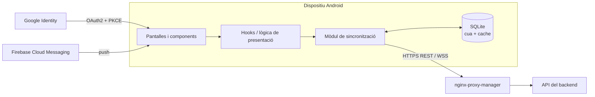

# Perseida · Frontend

[English](README.md) | **Català** | [Español](README.es.md)

> 🚧 **En construcció.** El projecte és en fase d'incepció/primer sprint. L'estructura i les ordres següents descriuen l'estat **previst** segons la documentació del projecte i poden canviar.

App mòbil i panell d'administració de **Perseida**, una aplicació multiplataforma de divulgació, exploració i seguiment de fenòmens astronòmics, desenvolupada com a projecte de PES (UPC-FIB). Construïda amb **React Native + Expo** i TypeScript. Pensada per a Android i iOS; de moment només es desplega la versió **Android** (APK).

## Què ofereix l'app

- **Mapa** interactiu i **llistat** filtrable d'esdeveniments astronòmics actius i futurs; creació, subscripció i detall d'esdeveniments.
- **APOD**: imatge astronòmica del dia de la NASA.
- **Gamificació**: ràtxa diària, fites desbloquejables (compartibles), quiz diari d'astrofísica, minijoc d'astronomia per reptar amics.
- **Comunitat**: seguiment d'usuaris, sales de xat d'esdeveniment, xats 1-a-1 amb històric persistent, compartició i votació de fotografies, publicacions efímeres de 24 h.
- **Zones d'observació** recomanades segons meteorologia, contaminació lumínica i ubicació de l'esdeveniment.
- **Notificacions** (FCM) configurables per tipus, data i proximitat; **exportació al calendari** (`.ics`).
- **Mode offline**: cua SQLite local i cache de lectura, sincronitzades més tard (last-write-wins).
- **Multiidioma**: català, castellà i anglès (detecció de l'idioma del dispositiu + selector).
- **Panell d'administració** (SPA amb React Native Web): gestió i suspensió d'usuaris, supervisió d'esdeveniments publicats, mètriques d'ús, cua de revisió de denúncies. Accés per rol.
- Tema fosc optimitzat per a ús nocturn.

## Stack tecnològic

| Àmbit | Tecnologia |
|---|---|
| Framework | React Native + **Expo** |
| Llenguatge | TypeScript (`strict`), motor Hermes |
| Estils | Tailwind |
| i18n | i18next |
| Emmagatzematge local | SQLite (cua + cache offline) |
| Autenticació | Google OAuth2 + PKCE |
| Push | Firebase Cloud Messaging |
| Tipus d'API | Generats a partir de l'esquema OpenAPI del backend (`openapi-typescript`) |
| Web d'administració | React Native Web (bundle estàtic servit per nginx-proxy-manager) |
| Dependències | `pnpm` |
| Qualitat | ESLint (TS, React, React Hooks), Prettier, SonarQube Cloud |
| Tests | Jest + React Native Testing Library |

## Arquitectura



## Estructura prevista

```
frontend/
├── app/ o src/        # pantalles, components, hooks, serveis (Expo)
├── assets/
├── locales/           # traduccions ca / es / en
├── __mocks__/         # respostes simulades de l'API per als tests
├── app.json           # configuració d'Expo
├── package.json
└── tsconfig.json
```

## Executar i testejar (previst)

```bash
pnpm install            # instal·la dependències
pnpm expo start         # arrenca el servidor de desenvolupament d'Expo (emulador Android / dispositiu)
pnpm lint               # ESLint + Prettier
pnpm tsc --noEmit       # comprovació de tipus (strict)
pnpm test               # Jest + React Native Testing Library
pnpm test --coverage
```

Releases: a cada release fusionada a `main`, GitHub Actions publica l'**APK** en una release de GitHub.

## Testing i qualitat

- Prioritat per als custom hooks i la lògica de presentació (estats de càrrega / error / llista buida, validació de formularis), components principals (targetes d'esdeveniment, pantalla APOD, ràtxa, formulari de denúncia, pantalles d'admin) i la comprovació que tots els textos de la UI tenen traducció en ca/es/en. El client de l'API se simula.
- El feedback de validació dels formularis ha d'aparèixer en < 100 ms sense crida a la xarxa.
- Codi nou de cada PR: cobertura ≥ 70 % i Quality Gate de SonarQube Cloud. Els components purament visuals queden exclosos de la cobertura.
- Els criteris d'acceptació dependents de la UI es verifiquen manualment a la branca release abans de cada sprint review. No hi ha proves end-to-end automatitzades.

## Convencions

- GitFlow amb branques `feature/*` des de `develop`; PR aprovada per una persona diferent de l'autora i amb CI en verd.
- Mateixes regles de TypeScript estricte i lint per a tot l'equip (fitxers de configuració versionats).
- El codi generat amb assistents d'IA passa exactament per la mateixa revisió i portes de qualitat.

## Relacionat

[Backend](../backend/README.ca.md) · [Infraestructura](../infra/README.ca.md) · [Obsidian vault](../obsidian_vault/README.ca.md)

## Equip

Manel Alaminos · Simona Duelt · Alex Garcia · Oriol Orbea · Javier Pascual · Raquel Rubio
