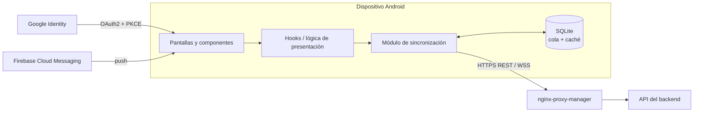

# Perseida · Frontend

[English](README.md) | [Català](README.ca.md) | **Español**

> 🚧 **En construcción.** El proyecto está en fase de inception/primer sprint. La estructura y los comandos siguientes describen el estado **previsto** según la documentación del proyecto y pueden cambiar.

App móvil y panel de administración de **Perseida**, una aplicación multiplataforma de divulgación, exploración y seguimiento de fenómenos astronómicos, desarrollada como proyecto de PES (UPC-FIB). Construida con **React Native + Expo** y TypeScript. Pensada para Android e iOS; de momento solo se despliega la versión **Android** (APK).

## Qué ofrece la app

- **Mapa** interactivo y **listado** filtrable de eventos astronómicos activos y futuros; creación, suscripción y detalle de eventos.
- **APOD**: imagen astronómica del día de la NASA.
- **Gamificación**: racha diaria, logros desbloqueables (compartibles), quiz diario de astrofísica, minijuego de astronomía para retar a amigos.
- **Comunidad**: seguimiento de usuarios, salas de chat de evento, chats 1-a-1 con histórico persistente, compartición y votación de fotografías, publicaciones efímeras de 24 h.
- **Zonas de observación** recomendadas según meteorología, contaminación lumínica y ubicación del evento.
- **Notificaciones** (FCM) configurables por tipo, fecha y proximidad; **exportación al calendario** (`.ics`).
- **Modo offline**: cola SQLite local y caché de lectura, sincronizadas más tarde (last-write-wins).
- **Multiidioma**: catalán, castellano e inglés (detección del idioma del dispositivo + selector).
- **Panel de administración** (SPA con React Native Web): gestión y suspensión de usuarios, supervisión de eventos publicados, métricas de uso, cola de revisión de denuncias. Acceso por rol.
- Tema oscuro optimizado para uso nocturno.

## Stack tecnológico

| Ámbito                | Tecnología                                                                |
| --------------------- | ------------------------------------------------------------------------- |
| Framework             | React Native + **Expo**                                                   |
| Lenguaje              | TypeScript (`strict`), motor Hermes                                       |
| Estilos               | Tailwind                                                                  |
| i18n                  | i18next                                                                   |
| Almacenamiento local  | SQLite (cola + caché offline)                                             |
| Autenticación         | Google OAuth2 + PKCE                                                      |
| Push                  | Firebase Cloud Messaging                                                  |
| Tipos de API          | Generados a partir del esquema OpenAPI del backend (`openapi-typescript`) |
| Web de administración | React Native Web (bundle estático servido por nginx-proxy-manager)        |
| Dependencias          | `pnpm`                                                                    |
| Calidad               | ESLint (TS, React, React Hooks), Prettier, SonarQube Cloud                |
| Tests                 | Jest + React Native Testing Library                                       |

## Arquitectura



## Estructura prevista

```
frontend/
├── app/ o src/        # pantallas, componentes, hooks, servicios (Expo)
├── assets/
├── locales/           # traducciones ca / es / en
├── __mocks__/         # respuestas simuladas de la API para los tests
├── app.json           # configuración de Expo
├── package.json
└── tsconfig.json
```

## Ejecutar y testear (previsto)

```bash
pnpm install            # instala dependencias
pnpm expo start         # arranca el servidor de desarrollo de Expo (emulador Android / dispositivo)
pnpm lint               # ESLint + Prettier
pnpm tsc --noEmit       # comprobación de tipos (strict)
pnpm test               # Jest + React Native Testing Library
pnpm test --coverage
```

Releases: en cada release fusionada en `main`, GitHub Actions publica el **APK** en una release de GitHub.

## Testing y calidad

- Prioridad para los custom hooks y la lógica de presentación (estados de carga / error / lista vacía, validación de formularios), componentes principales (tarjetas de evento, pantalla APOD, racha, formulario de denuncia, pantallas de admin) y la comprobación de que todos los textos de la UI tienen traducción en ca/es/en. El cliente de la API se simula.
- El feedback de validación de los formularios debe aparecer en < 100 ms sin llamada a red.
- Código nuevo de cada PR: cobertura ≥ 70 % y Quality Gate de SonarQube Cloud. Los componentes puramente visuales quedan excluidos de la cobertura.
- Los criterios de aceptación dependientes de la UI se verifican manualmente en la rama release antes de cada sprint review. No hay pruebas end-to-end automatizadas.

## Convenciones

- GitFlow con ramas `feature/*` desde `develop`; PR aprobada por una persona distinta de la autora y con CI en verde.
- Mismas reglas de TypeScript estricto y lint para todo el equipo (ficheros de configuración versionados).
- El código generado con asistentes de IA pasa exactamente por la misma revisión y puertas de calidad.

## Relacionado

[Backend](../backend/README.es.md) · [Infraestructura](../infra/README.es.md) · [Obsidian vault](../obsidian_vault/README.es.md)

## Equipo

Manel Alaminos · Simona Duelt · Alex Garcia · Oriol Orbea · Javier Pascual · Raquel Rubio
