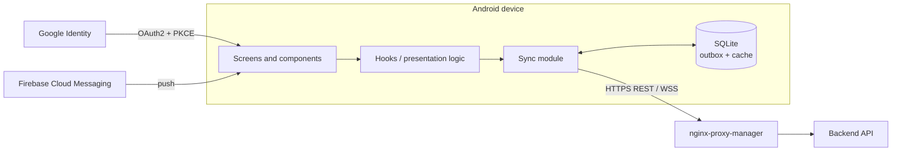

# Perseida · Frontend

**English** | [Català](README.ca.md) | [Español](README.es.md)

> 🚧 **Under construction.** The project is in its inception/first-sprint phase. Structure and commands below describe the **planned** state defined in the project documentation and may change.

Mobile app and admin panel of **Perseida**, a multiplatform app for astronomy outreach, exploration and tracking of astronomical events, built as a PES project (UPC-FIB). Built with **React Native + Expo** and TypeScript. It is designed for Android and iOS; for now only the **Android** version (APK) is deployed.

## What the app offers

- Interactive **map** and filterable **list** of active and upcoming astronomical events; event creation, subscription and details.
- **APOD**: NASA Astronomy Picture of the Day.
- **Gamification**: daily streak, unlockable achievements (shareable), daily astrophysics quiz, astronomy minigame to challenge friends.
- **Community**: follow users, event chat rooms, 1-to-1 chats with persistent history, photo sharing and voting, 24 h ephemeral posts.
- **Observation zones** recommended from weather, light pollution and event location.
- **Notifications** (FCM) configurable by type, date and proximity; **calendar export** (`.ics`).
- **Offline mode**: local SQLite outbox and read cache, synchronized later (last-write-wins).
- **Multi-language**: Catalan, Spanish and English (device language detection + selector).
- **Admin panel** (SPA with React Native Web): user management and suspension, published-event supervision, usage metrics, report review queue. Access by role.
- Dark theme optimized for night-time use.

## Tech stack

| Area | Technology |
|---|---|
| Framework | React Native + **Expo** |
| Language | TypeScript (`strict`), Hermes engine |
| Styling | Tailwind |
| i18n | i18next |
| Local storage | SQLite (outbox + offline cache) |
| Auth | Google OAuth2 + PKCE |
| Push | Firebase Cloud Messaging |
| API types | Generated from the backend OpenAPI schema (`openapi-typescript`) |
| Admin web | React Native Web (static bundle served by nginx-proxy-manager) |
| Dependencies | `pnpm` |
| Quality | ESLint (TS, React, React Hooks), Prettier, SonarQube Cloud |
| Tests | Jest + React Native Testing Library |

## Architecture



## Planned structure

```
frontend/
├── app/ or src/       # screens, components, hooks, services (Expo)
├── assets/
├── locales/           # ca / es / en translations
├── __mocks__/         # simulated API responses for tests
├── app.json           # Expo configuration
├── package.json
└── tsconfig.json
```

## Run and test (planned)

```bash
pnpm install            # install dependencies
pnpm expo start         # start the Expo dev server (Android emulator / device)
pnpm lint               # ESLint + Prettier
pnpm tsc --noEmit       # type check (strict)
pnpm test               # Jest + React Native Testing Library
pnpm test --coverage
```

Releases: on each release merged into `main`, GitHub Actions publishes the **APK** as a GitHub release.

## Testing and quality

- Priority on custom hooks and presentation logic (loading / error / empty states, form validation), main components (event cards, APOD screen, streak, report form, admin screens) and checking that every UI text has ca/es/en translation. The API client is mocked.
- Form validation feedback must appear in < 100 ms without a network call.
- New code of each PR: coverage ≥ 70 % and SonarQube Cloud Quality Gate. Purely visual components are excluded from coverage.
- UI-dependent acceptance criteria are checked manually on the release branch before each sprint review. No automated end-to-end tests.

## Conventions

- GitFlow with `feature/*` branches from `develop`; PR approved by someone other than the author, with passing CI.
- Same strict TypeScript and lint rules for the whole team (versioned config files).
- Code generated with AI assistants goes through exactly the same review and quality gates.

## Related

[Backend](../backend/README.md) · [Infrastructure](../infra/README.md) · [Obsidian vault](../obsidian_vault/README.md)

## Team

Manel Alaminos · Simona Duelt · Alex Garcia · Oriol Orbea · Javier Pascual · Raquel Rubio
