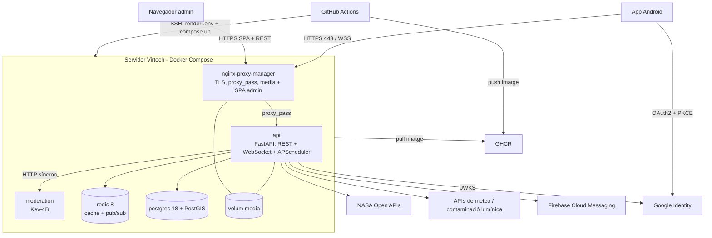

# Perseida · Infraestructura

[English](README.md) | **Català** | [Español](README.es.md)

> 🚧 **En construcció.** El projecte és en fase d'incepció/primer sprint. El contingut següent descriu l'estat **previst** segons la documentació del projecte i pot canviar.

Configuració de Docker i de desplegament de **Perseida**, una aplicació multiplataforma de divulgació i seguiment de fenòmens astronòmics (projecte de PES, UPC-FIB). Defineix com s'executa tot el sistema en local i en producció.

## Visió general del desplegament

Tot s'executa en **un únic servidor proporcionat per Virtech**, orquestrat amb **Docker Compose** (Kubernetes s'ha descartat explícitament: amb un sol host físic només afegeix overhead de control plane i el punt únic de fallada continua sent el servidor).



## Serveis (Docker Compose)

| Servei | Rol |
|---|---|
| `nginx-proxy-manager` | Punt d'entrada únic: HTTPS/TLS (certificats gestionats), proxy cap a l'API, upgrade de WebSocket, serveix els fitxers multimèdia dels usuaris des del volum compartit i el bundle estàtic del panell d'administració. |
| `api` | Imatge del backend `perseida-api:<git-sha>`. Un sol procés: REST + WebSocket + APScheduler. Executa les migracions d'Alembic a l'entrypoint abans d'arrencar. |
| `postgres` | PostgreSQL 18 + PostGIS, volum `pgdata` (font de veritat). |
| `redis` | Redis 8, cache amb TTL i pub/sub. Res essencial viu només aquí. |
| `moderation` | Servei del model Kev-4B, versió fixada, límits de recursos i healthcheck; accessible només des de la xarxa interna de Docker. |

## CI/CD (GitHub Actions)

- **CI** a cada PR cap a `develop`/`main`, amb filtres per ruta i cache de dependències `uv`/`pnpm`: format, linters i tipus → tests amb cobertura → SonarQube Cloud → Quality Gate. Obligatori per fusionar.
- **CD** a cada push a `main` (fusió de release o hotfix):
  1. Construeix la imatge del backend, l'etiqueta amb el `git-sha` i la puja a **GHCR**.
  2. Es connecta al servidor de Virtech per **SSH**, renderitza el `.env` des dels secrets de GitHub (`chmod 600`) i executa `docker compose up`.
  3. Publica l'**APK** del frontend en una release de GitHub.
- Versionat: SemVer a partir de `0.1.0`, una release per sprint, automatitzat pel pipeline.
- Rollback: redesplegar la imatge anterior pel seu `git-sha`.
- El repositori també conté una automatització que desbloqueja tasques de Taiga (`.github/workflows/taiga-unblock.yml`).

## Configuració i secrets

- Els secrets i variables viuen a **Secrets and variables** de GitHub; el job de CD genera el `.env` al servidor. El `.env` **mai** es versiona; un `.env.example` sense valors fa de plantilla.
- Versions fixades: PostgreSQL 18 (+ PostGIS), Redis 8, imatge de Kev-4B.
- Només dos entorns: **local** (el mateix Docker Compose) i **producció** (Virtech). Sense staging.

## Estructura prevista

```
infra/
├── docker-compose.yml        # els cinc serveis (local i producció)
├── .env.example
├── nginx-proxy-manager/      # configuració del proxy
└── moderation/               # imatge/configuració del servei Kev-4B
```

## Executar en local (previst)

```bash
cp .env.example .env          # omple valors locals, mai facis commit del .env
docker compose up -d --build
docker compose ps
docker compose logs -f api
docker compose down
```

## Limitacions conegudes (assumides en un projecte acadèmic)

Sense escalat horitzontal ni còpies de seguretat automàtiques; el servidor és un punt únic de fallada.

## Relacionat

[Backend](../backend/README.ca.md) · [Frontend](../frontend/README.ca.md) · [Obsidian vault](../obsidian_vault/README.ca.md)

## Equip

Manel Alaminos · Simona Duelt · Alex Garcia · Oriol Orbea · Javier Pascual · Raquel Rubio
