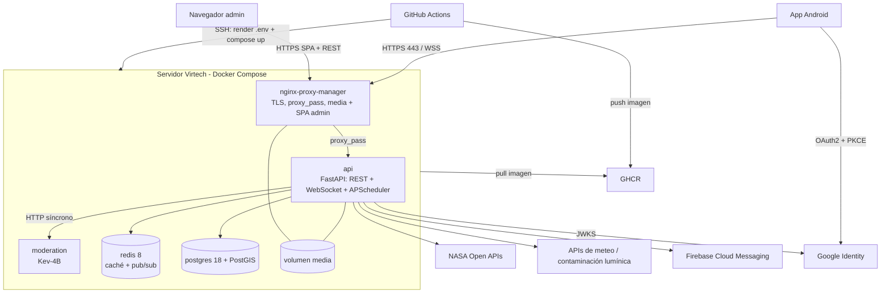

# Perseida · Infraestructura

[English](README.md) | [Català](README.ca.md) | **Español**

> 🚧 **En construcción.** El proyecto está en fase de inception/primer sprint. El contenido siguiente describe el estado **previsto** según la documentación del proyecto y puede cambiar.

Configuración de Docker y de despliegue de **Perseida**, una aplicación multiplataforma de divulgación y seguimiento de fenómenos astronómicos (proyecto de PES, UPC-FIB). Define cómo se ejecuta todo el sistema en local y en producción.

## Visión general del despliegue

Todo se ejecuta en **un único servidor proporcionado por Virtech**, orquestado con **Docker Compose** (Kubernetes se descartó explícitamente: con un solo host físico solo añade overhead de control plane y el punto único de fallo sigue siendo el servidor).



## Servicios (Docker Compose)

| Servicio | Rol |
|---|---|
| `nginx-proxy-manager` | Punto de entrada único: HTTPS/TLS (certificados gestionados), proxy hacia la API, upgrade de WebSocket, sirve los ficheros multimedia de los usuarios desde el volumen compartido y el bundle estático del panel de administración. |
| `api` | Imagen del backend `perseida-api:<git-sha>`. Un solo proceso: REST + WebSocket + APScheduler. Ejecuta las migraciones de Alembic en el entrypoint antes de arrancar. |
| `postgres` | PostgreSQL 18 + PostGIS, volumen `pgdata` (fuente de verdad). |
| `redis` | Redis 8, caché con TTL y pub/sub. Nada esencial vive solo aquí. |
| `moderation` | Servicio del modelo Kev-4B, versión fijada, límites de recursos y healthcheck; accesible solo desde la red interna de Docker. |

## CI/CD (GitHub Actions)

- **CI** en cada PR hacia `develop`/`main`, con filtros por ruta y caché de dependencias `uv`/`pnpm`: formato, linters y tipos → tests con cobertura → SonarQube Cloud → Quality Gate. Obligatorio para fusionar.
- **CD** en cada push a `main` (fusión de release o hotfix):
  1. Construye la imagen del backend, la etiqueta con el `git-sha` y la sube a **GHCR**.
  2. Se conecta al servidor de Virtech por **SSH**, renderiza el `.env` desde los secretos de GitHub (`chmod 600`) y ejecuta `docker compose up`.
  3. Publica el **APK** del frontend en una release de GitHub.
- Versionado: SemVer a partir de `0.1.0`, una release por sprint, automatizado por el pipeline.
- Rollback: redesplegar la imagen anterior por su `git-sha`.
- El repositorio también contiene una automatización que desbloquea tareas de Taiga (`.github/workflows/taiga-unblock.yml`).

## Configuración y secretos

- Los secretos y variables viven en **Secrets and variables** de GitHub; el job de CD genera el `.env` en el servidor. El `.env` **nunca** se versiona; un `.env.example` sin valores hace de plantilla.
- Versiones fijadas: PostgreSQL 18 (+ PostGIS), Redis 8, imagen de Kev-4B.
- Solo dos entornos: **local** (el mismo Docker Compose) y **producción** (Virtech). Sin staging.

## Estructura prevista

```
infra/
├── docker-compose.yml        # los cinco servicios (local y producción)
├── .env.example
├── nginx-proxy-manager/      # configuración del proxy
└── moderation/               # imagen/configuración del servicio Kev-4B
```

## Ejecutar en local (previsto)

```bash
cp .env.example .env          # rellena valores locales, nunca hagas commit del .env
docker compose up -d --build
docker compose ps
docker compose logs -f api
docker compose down
```

## Limitaciones conocidas (asumidas en un proyecto académico)

Sin escalado horizontal ni copias de seguridad automáticas; el servidor es un punto único de fallo.

## Relacionado

[Backend](../backend/README.es.md) · [Frontend](../frontend/README.es.md) · [Obsidian vault](../obsidian_vault/README.es.md)

## Equipo

Manel Alaminos · Simona Duelt · Alex Garcia · Oriol Orbea · Javier Pascual · Raquel Rubio
