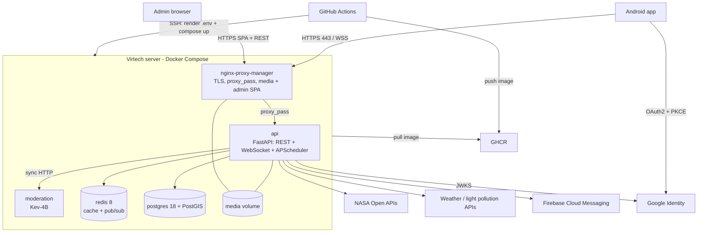

# Perseida · Infrastructure

**English** | [Català](README.ca.md) | [Español](README.es.md)

> 🚧 **Under construction.** The project is in its inception/first-sprint phase. Contents below describe the **planned** state defined in the project documentation and may change.

Docker and deployment configuration of **Perseida**, a multiplatform app for astronomy outreach and tracking of astronomical events (PES project, UPC-FIB). It defines how the whole system runs locally and in production.

## Deployment overview

Everything runs on **a single server provided by Virtech**, orchestrated with **Docker Compose** (Kubernetes was explicitly discarded: with one physical host it only adds control-plane overhead and the single point of failure remains the server).



## Services (Docker Compose)

| Service | Role |
|---|---|
| `nginx-proxy-manager` | Single entry point: HTTPS/TLS (managed certificates), proxy to the API, WebSocket upgrade, serves user media from the shared volume and the static admin panel bundle. |
| `api` | Backend image `perseida-api:<git-sha>`. One process: REST + WebSocket + APScheduler. Runs Alembic migrations at the entrypoint before starting. |
| `postgres` | PostgreSQL 18 + PostGIS, `pgdata` volume (source of truth). |
| `redis` | Redis 8, cache with TTL and pub/sub. Nothing essential lives only here. |
| `moderation` | Kev-4B model service, fixed version, resource limits and healthcheck; reachable only from the internal Docker network. |

## CI/CD (GitHub Actions)

- **CI** on every PR to `develop`/`main`, with path filters and cached `uv`/`pnpm` dependencies: format, linters and types → tests with coverage → SonarQube Cloud → Quality Gate. Required to merge.
- **CD** on every push to `main` (release or hotfix merge):
  1. Build the backend image, tag it with the `git-sha` and push it to **GHCR**.
  2. Connect to the Virtech server over **SSH**, render `.env` from GitHub secrets (`chmod 600`) and run `docker compose up`.
  3. Publish the frontend **APK** in a GitHub release.
- Versioning: SemVer starting at `0.1.0`, one release per sprint, automated by the pipeline.
- Rollback: redeploy the previous image by its `git-sha`.
- The repository also contains an automation that unblocks Taiga tasks (`.github/workflows/taiga-unblock.yml`).

## Configuration and secrets

- Secrets and variables live in GitHub **Secrets and variables**; the CD job generates `.env` on the server. `.env` is **never** committed; a value-free `.env.example` is the template.
- Pinned versions: PostgreSQL 18 (+ PostGIS), Redis 8, Kev-4B image.
- Two environments only: **local** (same Docker Compose) and **production** (Virtech). No staging.

## Planned structure

```
infra/
├── docker-compose.yml        # the five services (local and production)
├── .env.example
├── nginx-proxy-manager/      # proxy configuration
└── moderation/               # Kev-4B service image/config
```

## Run locally (planned)

```bash
cp .env.example .env          # fill in local values, never commit .env
docker compose up -d --build
docker compose ps
docker compose logs -f api
docker compose down
```

## Known limitations (accepted for an academic project)

No horizontal scaling and no automatic backups; the server is a single point of failure.

## Related

[Backend](../backend/README.md) · [Frontend](../frontend/README.md) · [Obsidian vault](../obsidian_vault/README.md)

## Team

Manel Alaminos · Simona Duelt · Alex Garcia · Oriol Orbea · Javier Pascual · Raquel Rubio
