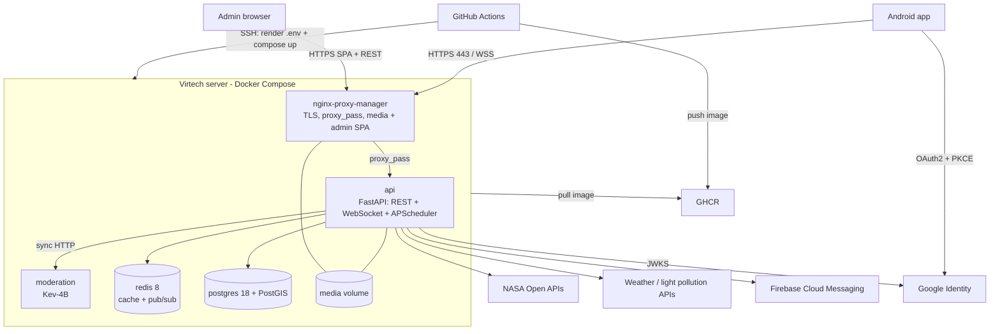

# Arquitectura física i desplegament

Perseida es desplega sobre **un únic servidor de Virtech** on Docker Compose orquestra **cinc contenidors**. Kubernetes es va descartar explícitament: amb un sol host físic només afegeix overhead de control plane i el punt únic de fallada continua sent el servidor ([[0002-docker-compose-en-lloc-de-kubernetes]]).

> [!warning] Estat
> Descripció de l'estat **planificat**: `infra/docker-compose.yml` encara no existeix (US TG-37).

## Diagrama

## Serveis de Compose

| Servei | Rol | Nota |
|---|---|---|
| `nginx-proxy-manager` | Únic punt d'entrada: TLS, proxy a l'API, upgrade WebSocket, serveix media i la SPA d'admin | [[nginx-proxy-manager]] |
| `api` | Imatge `perseida-api:<git-sha>`; un sol procés; Alembic a l'entrypoint | [[api]] |
| `postgres` | PostgreSQL 18 + PostGIS, volum `pgdata` (font de veritat) | [[postgres]] |
| `redis` | Redis 8, cache amb TTL i pub/sub; res essencial | [[redis]] |
| `moderation` | Servei Kev-4B; només xarxa interna de Docker | [[moderation]] |

## Flux de desplegament (CI/CD)

- **CI** a cada PR cap a `develop`/`main`: format, linters i tipus, tests amb cobertura, SonarQube Cloud i Quality Gate. Obligatori per fusionar.
- **CD** a cada push a `main` (merge de release o hotfix):
  1. Construeix la imatge del backend, l'etiqueta amb el `git-sha` i la puja a **GHCR**.
  2. Es connecta per **SSH** al servidor de Virtech, renderitza el `.env` des dels secrets de GitHub (`chmod 600`) i executa `docker compose up`.
  3. Publica l'**APK** del frontend en una release de GitHub.
- **Rollback**: tornar a desplegar la imatge anterior pel seu `git-sha`.
- Versionat SemVer des de `0.1.0`, una release per sprint.

## Entorns

Només dos: **local** (el mateix Docker Compose) i **producció** (Virtech). No hi ha staging.

## Configuració i secrets

Els secrets i variables viuen a GitHub *Secrets and variables*; el `.env` mai es versiona, només un `.env.example` sense valors. Versions fixades: PostgreSQL 18 (+PostGIS), Redis 8 i la imatge de Kev-4B.

## Limitacions acceptades

Sense escalat horitzontal ni còpies de seguretat automàtiques; el servidor és un punt únic de fallada.

## Enllaços

- [[visio-general]], [[backend-hexagonal]], [[serveis-externs]]
- [[0002-docker-compose-en-lloc-de-kubernetes]], [[0009-nginx-proxy-manager-serveix-media-i-spa-admin]]
- [[gitflow]], [[qualitat]]
