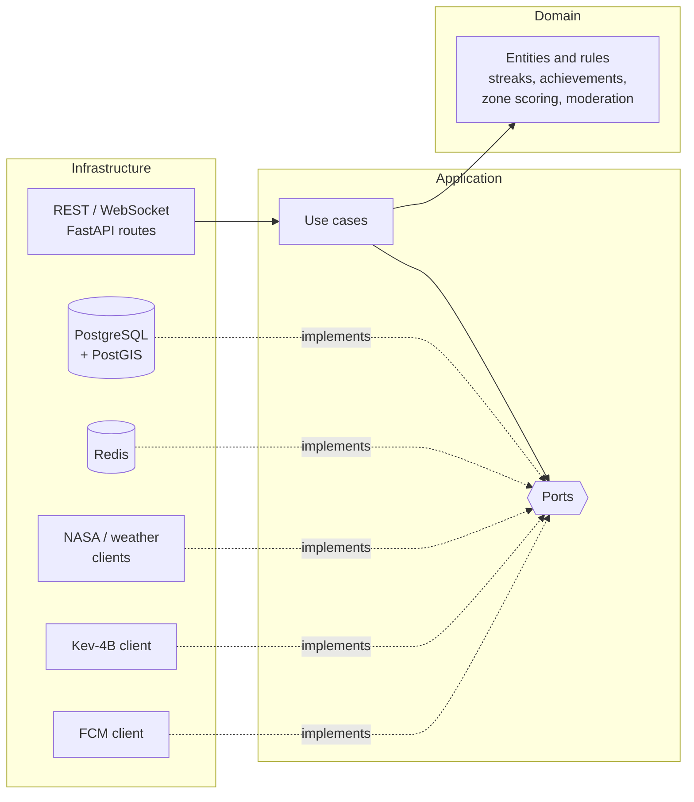

# Backend: arquitectura hexagonal

Un **únic procés FastAPI** (async) integra tres responsabilitats ([[0003-un-sol-proces-fastapi]]): API REST per a l'app i el panell d'admin, WebSocket per al xat en temps real (amb pub/sub de Redis) i planificador APScheduler in-process (notificacions programades, reinici de ràtxes diàries i purga de contingut caducat).

> [!warning] Estat
> Descripció de l'estat **planificat**; `backend/` encara només conté README.

## Capes



- `domain`: entitats riques (validen invariants i multiplicitats), value objects, errors de domini i **ports**. Sense dependència de frameworks, BD ni serveis externs; l'única llibreria externa permesa és Pydantic ([[0016-ports-i-entitats-riques-al-domini]]). Els tests s'escriuen després del codi ([[0019-tests-despres-del-codi]]; vegeu [[0004-arquitectura-hexagonal-i-tdd-al-domini]]).
- `application`: casos d'ús com a **services singleton** injectats amb `Depends` ([[0017-injeccio-de-dependencies-i-services-singleton]]); orquestren el domini a través dels ports.
- `infrastructure`: tot el que toca l'exterior: endpoints, WebSockets, persistència, Redis, clients externs i *exception handlers* ([[0018-errors-rfc-9457-amb-codis-estables]]). Implementa els ports del domini.

Les dependències només van cap endins (`infrastructure` → `application` → `domain`) i cada capa s'organitza per mòduls (`app/<capa>/<mòdul>/`).

## Patró per a dades externes

Per exemple l'APOD: la primera petició crida l'API externa i desa el resultat a Redis (i a PostgreSQL si cal); les següents es serveixen de la cache. Si l'API externa cau, es retornen les dades en cache en lloc d'un 500 ([[0005-redis-nomes-com-a-cache-lazy]]).

## Stack

Python, FastAPI (async), SQLModel (SQLAlchemy) + Alembic (s'executa a l'entrypoint del contenidor), PostgreSQL 18 + PostGIS, Redis 8, APScheduler, `uv`. Autenticació: Google OAuth2 + PKCE, validació de tokens de Google via JWKS i sessió pròpia (JWT) ([[0008-google-oauth2-pkce-jwks-i-sessio-propia]]). Moderació: microservei Kev-4B amb crida síncrona ([[0007-moderacio-local-kev-4b-sincrona]]).

## Estructura planificada

```
backend/
├── app/
│   ├── domain/<module>/        # rich entities, value objects, errors, ports
│   ├── application/<module>/   # use cases (singleton services)
│   └── infrastructure/<module>/ # API routes, persistence, redis, external clients
├── alembic/               # migrations
├── tests/
│   ├── fixtures/          # recorded NASA/weather responses, geo data
│   ├── factories/         # users, events, messages, achievements
│   └── moderation_dataset/# labeled Kev-4B evaluation set (ca/es/en)
├── pyproject.toml
└── .env.example
```

## Qualitat i proves

`ruff` (complexitat màxima 10), `mypy` strict, SonarQube Cloud. Piràmide de tests ~70 % unitaris / ~30 % integració. Cobertura: domini ≥ 80 %, aplicació ≥ 70 %, codi nou de cada PR ≥ 70 %. Llindars NFR: recursos en cache ≤ 200 ms, consultes de proximitat ≤ 150 ms, endpoints privats rebutgen peticions sense sessió vàlida (401/403). Detalls a [[testing]] i [[qualitat]].

## Enllaços

- [[visio-general]], [[api]], [[postgres]], [[redis]], [[moderation]]
- [[serveis-externs]], [[contracte-spotwise]], [[model-de-domini]]
