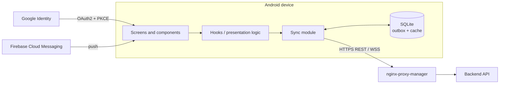

# Frontend: app mòbil i panell d'administració

App i panell d'administració de Perseida amb **React Native + Expo** i TypeScript. Pensada per a Android i iOS; de moment només es desplega la versió **Android** (APK).

> [!warning] Estat
> Descripció de l'estat **planificat**; `frontend/` encara només conté README.

## Stack

| Àrea | Tecnologia |
|---|---|
| Framework | React Native + Expo |
| Llenguatge | TypeScript (`strict`), motor Hermes |
| Estils | Tailwind |
| i18n | i18next (català, castellà i anglès; detecció d'idioma del dispositiu + selector) |
| Emmagatzematge local | SQLite (outbox + cache offline) |
| Auth | Google OAuth2 + PKCE |
| Push | Firebase Cloud Messaging |
| Tipus d'API | Generats de l'esquema OpenAPI del backend (`openapi-typescript`) |
| Admin web | React Native Web (bundle estàtic servit per nginx-proxy-manager) |
| Dependències | `pnpm` |
| Qualitat i tests | ESLint, Prettier, SonarQube Cloud; Jest + React Native Testing Library |

## Arquitectura



## Mode offline

SQLite local com a outbox i cache de lectura, sincronitzats més tard amb política **last-write-wins** ([[0011-client-offline-sqlite-last-write-wins]]).

## Panell d'administració

SPA amb React Native Web: gestió i suspensió d'usuaris, supervisió d'esdeveniments publicats, mètriques d'ús i cua de revisió d'informes. Accés per rol. El bundle estàtic el serveix [[nginx-proxy-manager]] ([[0009-nginx-proxy-manager-serveix-media-i-spa-admin]]).

## Estructura planificada

```
frontend/
├── app/ or src/       # screens, components, hooks, services (Expo)
├── assets/
├── locales/           # ca / es / en translations
├── __mocks__/         # simulated API responses for tests
├── app.json           # Expo configuration
├── package.json
└── tsconfig.json
```

## Proves i qualitat

- Prioritat: hooks propis i lògica de presentació (estats de càrrega/error/buit, validació de formularis), components principals i que cada text de la UI tingui traducció ca/es/en. El client d'API es simula.
- El feedback de validació de formularis ha d'aparèixer en < 100 ms sense crida de xarxa.
- Codi nou de cada PR: cobertura ≥ 70 % i Quality Gate de SonarQube Cloud. Els components purament visuals queden fora de la cobertura.
- Els criteris d'acceptació dependents de la UI es comproven manualment a la branca de release abans de cada sprint review. No hi ha tests end-to-end automàtics.
- En cada release fusionada a `main`, GitHub Actions publica l'**APK** com a release de GitHub.

## Enllaços

- [[visio-general]], [[backend-hexagonal]], [[serveis-externs]]
- [[0011-client-offline-sqlite-last-write-wins]], [[0008-google-oauth2-pkce-jwks-i-sessio-propia]]
- [[testing]], [[qualitat]]
