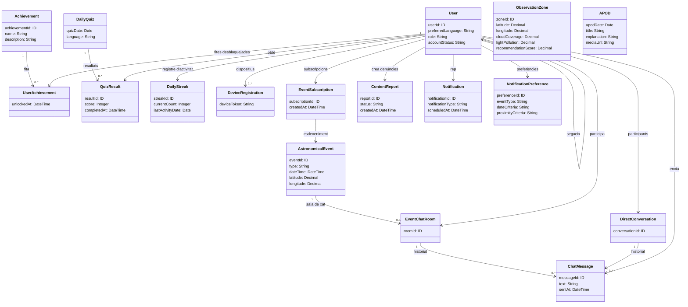

# Model de domini

Classes del diagrama UML de la incepció 2 (§7), agrupades pels seus quatre paquets.

> [!warning] Pot canviar
> Les classes i relacions representades poden canviar al llarg del projecte (així ho diu la incepció 2).

> [!note] Lectura del diagrama
> Els atributs i les etiquetes de relació s'han transcrit tal com es llegeixen a la imatge. Les multiplicitats d'alguns extrems no es llegeixen amb claredat (línies que se solapen al voltant de `User`); aquí només es llisten les que es veuen bé i la resta es dona sense multiplicitat.

## Gamificació

| Classe | Atributs |
|---|---|
| `Achievement` | `achievementId: ID`, `name: String`, `description: String` |
| `UserAchievement` | `unlockedAt: DateTime` |
| `DailyQuiz` | `quizDate: Date`, `language: String` |
| `QuizResult` | `resultId: ID`, `score: Integer`, `completedAt: DateTime` |
| `DailyStreak` | `streakId: ID`, `currentCount: Integer`, `lastActivityDate: Date` |

## Usuaris i esdeveniments

| Classe | Atributs |
|---|---|
| `User` | `userId: ID`, `preferredLanguage: String`, `role: String`, `accountStatus: String` |
| `DeviceRegistration` | `deviceToken: String` |
| `EventSubscription` | `subscriptionId: ID`, `createdAt: DateTime` |
| `AstronomicalEvent` | `eventId: ID`, `type: String`, `dateTime: DateTime`, `latitude: Decimal`, `longitude: Decimal` |
| `ObservationZone` | `zoneId: ID`, `latitude: Decimal`, `longitude: Decimal`, `cloudCoverage: Decimal`, `lightPollution: Decimal`, `recommendationScore: Decimal` |
| `APOD` | `apodDate: Date`, `title: String`, `explanation: String`, `mediaUrl: String` |

## Notificacions i moderació

| Classe | Atributs |
|---|---|
| `ContentReport` | `reportId: ID`, `status: String`, `createdAt: DateTime` |
| `Notification` | `notificationId: ID`, `notificationType: String`, `scheduledAt: DateTime` |
| `NotificationPreference` | `preferenceId: ID`, `eventType: String`, `dateCriteria: String`, `proximityCriteria: String` |

## Comunitat i missatgeria

| Classe | Atributs |
|---|---|
| `EventChatRoom` | `roomId: ID` |
| `DirectConversation` | `conversationId: ID` |
| `ChatMessage` | `messageId: ID`, `text: String`, `sentAt: DateTime` |

## Relacions principals

Etiquetes tal com apareixen al diagrama:

- `Achievement` 1 — 0..* `UserAchievement` («fita»); `User` — `UserAchievement` («fites desbloquejades»).
- `DailyQuiz` 1 — 0..* `QuizResult` («resultats»); `User` — `QuizResult` («obté»).
- `User` — `DailyStreak` («registre d'activitat»).
- `User` 1 — 0..* `DeviceRegistration` («dispositius»); `User` — `User` («segueix»).
- `User` — `EventSubscription` («subscripcions») — `AstronomicalEvent` («esdeveniment»).
- `User` — `ContentReport` («crea denúncies»); `User` — `Notification` («rep»); `User` — `NotificationPreference` («preferències»).
- `AstronomicalEvent` 1 — 0..1 `EventChatRoom` («sala de xat»).
- `EventChatRoom` 1 — 0..* `ChatMessage` («historial»); `DirectConversation` 1 — 0..* `ChatMessage` («historial»).
- `User` — `EventChatRoom` («participa»); `User` — `ChatMessage` («envia»); `User` — `DirectConversation` («participants», 2 usuaris per conversa).
- `ObservationZone` i `APOD` apareixen al paquet «Usuaris i esdeveniments» sense cap relació dibuixada.

## Diagrama (transcripció)

## Enllaços

- [[visio-general]], [[backend-hexagonal]], [[postgres]]
- [[0004-arquitectura-hexagonal-i-tdd-al-domini]], [[0006-postgresql-postgis-font-de-veritat]]
- [[epiques-i-us]]
