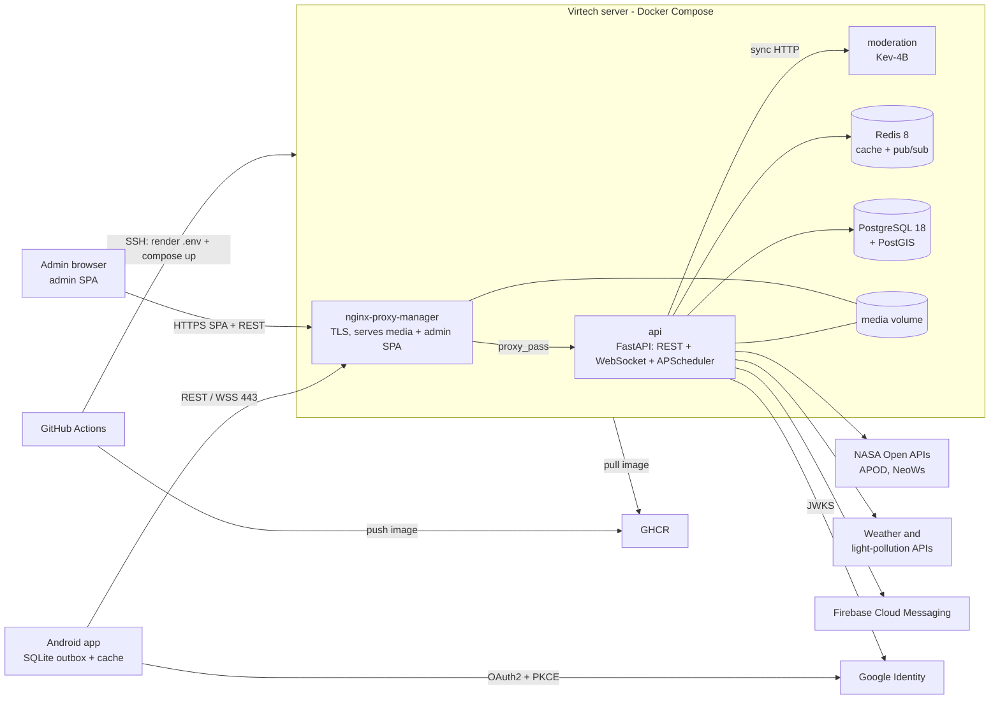

# Visió general de l'arquitectura

Perseida és una app mòbil multiplataforma de divulgació i seguiment d'esdeveniments astronòmics (projecte PES, UPC-FIB). Tot el sistema s'executa en **un sol servidor de Virtech** orquestrat amb **Docker Compose** ([[0002-docker-compose-en-lloc-de-kubernetes]]).

> [!warning] Estat
> Els README descriuen l'estat **planificat**: el projecte és en fase d'incepció/primer sprint i el fitxer Compose encara no existeix (US TG-37).

## Monorepo

Quatre directoris més `.agents/` ([[0001-monorepo-quatre-directoris]]):

| Directori | Contingut |
|---|---|
| `backend/` | Servei FastAPI: API REST, xat en temps real (WebSocket) i planificador in-process. Arquitectura hexagonal ([[backend-hexagonal]]). |
| `frontend/` | App React Native + Expo (APK Android de moment) i panell d'administració (React Native Web) ([[frontend]]). |
| `infra/` | Docker Compose, configuració de desplegament i CI/CD (GitHub Actions) ([[arquitectura-fisica]]). |
| `obsidian_vault/` | Documentació del projecte: context compartit per a l'equip i els assistents d'IA. |
| `.agents/` | Skills i context per als assistents d'IA ([[assistents-ia]]). No és a la taula de quatre directoris del README d'arrel; ve d'`AGENTS.md`. |

## Diagrama del sistema

## Stack

| Àrea | Tecnologia |
|---|---|
| Frontend | React Native + Expo, TypeScript, Tailwind, i18next, SQLite, `pnpm` |
| Backend | Python, FastAPI, SQLModel + Alembic, APScheduler, `uv` |
| Dades | PostgreSQL 18 + PostGIS, Redis 8 |
| Moderació | Kev-4B (model local) |
| Autenticació | Google OAuth2 + PKCE |
| Infraestructura | Docker Compose, nginx-proxy-manager, GitHub Actions, GHCR |
| Qualitat | `ruff`, `mypy`, ESLint, Prettier, `pytest`, Jest, SonarQube Cloud |

## Limitacions acceptades

> [!note]
> Dins l'abast d'un projecte acadèmic: un sol servidor és un punt únic de fallada, sense escalat horitzontal ni còpies de seguretat automàtiques. iOS és compatible (React Native) però no es desplega: caldria un Mac, un compte Apple Developer i una clau APNs.

## Enllaços

- [[arquitectura-fisica]], [[backend-hexagonal]], [[frontend]], [[model-de-domini]]
- [[serveis-externs]], [[contracte-spotwise]]
- Components: [[api]], [[postgres]], [[redis]], [[nginx-proxy-manager]], [[moderation]]
- Decisions: [[0003-un-sol-proces-fastapi]], [[0004-arquitectura-hexagonal-i-tdd-al-domini]], [[0006-postgresql-postgis-font-de-veritat]]
